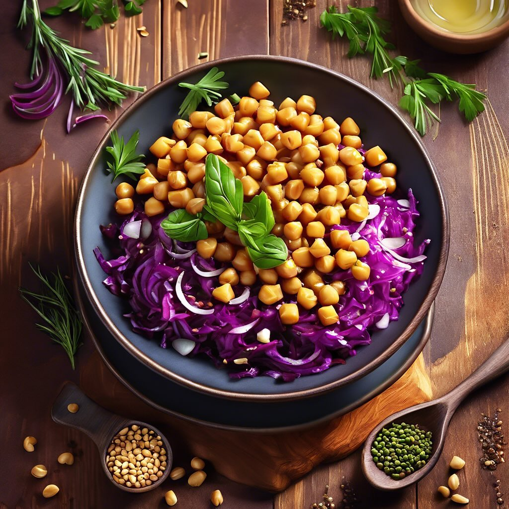

# **Insalata di Ceci con Cavolo Cappuccio Rosso e Pinoli**

**Insalata di Ceci con Cavolo Cappuccio Rosso e Pinoli**. ### Ingredienti: - 400 g di ceci cotti (in scatola o lessati) - 200 g di cavolo cappuccio rosso, tagliato a strisce sottili - 50 g di pinoli - 1 cucchiaio di miele - 1 cipolla rossa, affettata sottilmente - 2 cucchiai di capperi, sciacquati - Succo di 1 limone - Olio extravergine d’oliva q.b. - Sale e pepe q.b. ### Procedimento: 1. **Tostare i pinoli**: In una padella antiaderente, tosta i pinoli a fuoco medio fino a doratura, mescolando frequentemente. Rimuovili dalla padella e mettili da parte. 2. **Preparare il condimento**: In una ciotola, unisci il miele, il succo di limone, l’olio d’oliva, sale e pepe. Mescola bene fino a ottenere un’emulsione. 3. **Mescolare gli ingredienti**: In una grande ciotola, unisci i ceci, il cavolo cappuccio rosso, la cipolla affettata e i capperi. Aggiungi il condimento e mescola delicatamente per amalgamare tutti gli ingredienti. 4. **Aggiungere i pinoli**: Prima di servire, incorpora i pinoli tostati e mescola nuovamente. 5. **Servire**: Lascia riposare l’insalata per circa 15 minuti per permettere ai sapori di amalgamarsi. Servire fresca come antipasto o contorno.

---

*Ricetta da @leguminando*
