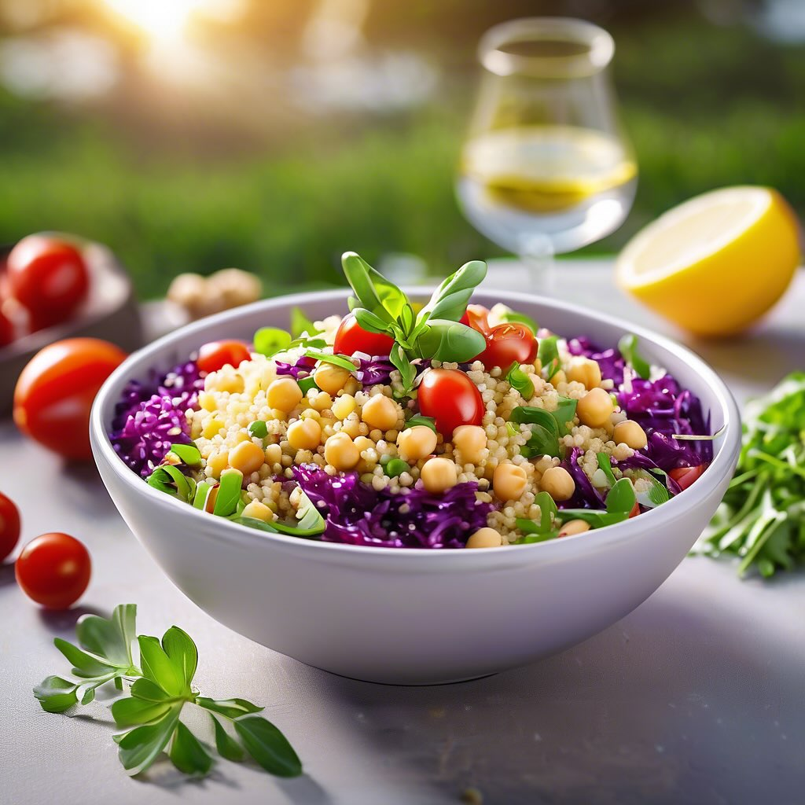

# ## Insalata di Couscous Estiva #### Ingredienti: - 200 g di couscous - 150 g di 

## Insalata di Couscous Estiva #### Ingredienti: - 200 g di couscous - 150 g di cavolo (puoi usare cavolo rosso o verde) - 200 g di pomodori (preferibilmente pomodorini) - 150 g di ceci (già cotti o in scatola) - Un mazzetto di rucola - Olio extravergine d’oliva - Succo di limone - Sale e pepe q.b. - Erbe fresche (prezzemolo o basilico) per guarnire #### Preparazione: 1. **Cottura del couscous**: In una ciotola, versa il couscous e aggiungi una quantità di acqua bollente pari al suo volume. Copri e lascia riposare per circa 5 minuti. Poi sgranalo con una forchetta. 2. **Preparazione delle verdure**: Taglia il cavolo a striscioline e i pomodori a cubetti. In una grande ciotola, unisci il couscous sgranato, il cavolo, i pomodori e i ceci. 3. **Condimento**: Aggiungi un filo d’olio d’oliva, il succo di limone, sale e pepe a piacere. Mescola bene per amalgamare tutti gli ingredienti. 4. **Aggiunta della rucola**: Infine, aggiungi la rucola e mescola delicatamente. 5. **Servizio**: Servi l’insalata di couscous fredda, guarnita con erbe fresche.

---

*Ricetta da @leguminando*
