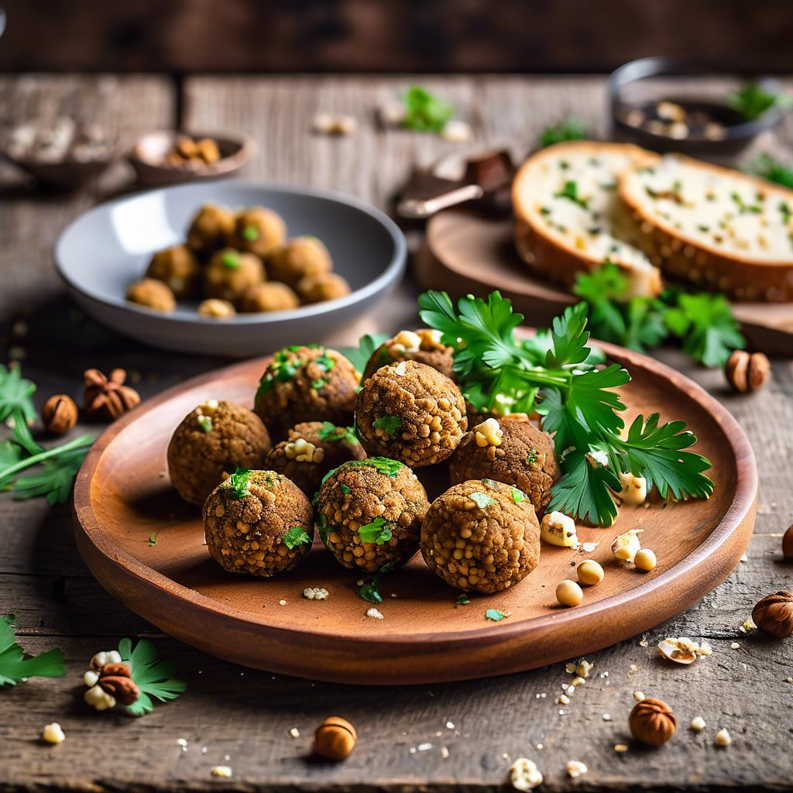

# ### Insalata di Fave, Asparagi e Pancetta #### Ingredienti: - 300 g di fave fres

### Insalata di Fave, Asparagi e Pancetta #### Ingredienti: - 300 g di fave fresche (o surgelate) - 200 g di asparagi - 100 g di pancetta affumicata - 1 cucchiaio di olio extravergine d’oliva - Sale e pepe q.b. - Succo di limone q.b. - Erbe aromatiche fresche (menta o prezzemolo) per guarnire #### Preparazione: 1. **Preparazione delle fave**: - Se utilizzate fave fresche, sgranatele e sbollentatele in acqua salata per 2-3 minuti. Scolatele e raffreddatele in acqua e ghiaccio per mantenere il colore. Se usate fave surgelate, seguite le istruzioni sulla confezione. 2. **Cottura degli asparagi**: - Pulite gli asparagi, eliminando le estremità legnose. Sbollentateli in acqua salata per 3-4 minuti, quindi scolateli e raffreddateli in acqua e ghiaccio. Una volta freddi, tagliateli a pezzi di circa 4-5 cm. 3. **Cottura della pancetta**: - In una padella antiaderente, fate rosolare la pancetta a fuoco medio fino a quando diventa croccante. Scolatela su carta assorbente per eliminare l’eccesso di grasso. 4. **Assemblaggio del piatto**: - In una ciotola, unite le fave, gli asparagi e la pancetta croccante. Condite con olio extravergine d’oliva, succo di limone, sale e pepe a piacere. Mescolate delicatamente per amalgamare gli ingredienti. 5. **Impiattamento**: - Trasferite l’insalata su un piatto da portata e guarnite con erbe aromatiche fresche. Servite subito per apprezzare la freschezza degli ingredienti.

---

*Ricetta da @leguminando*
