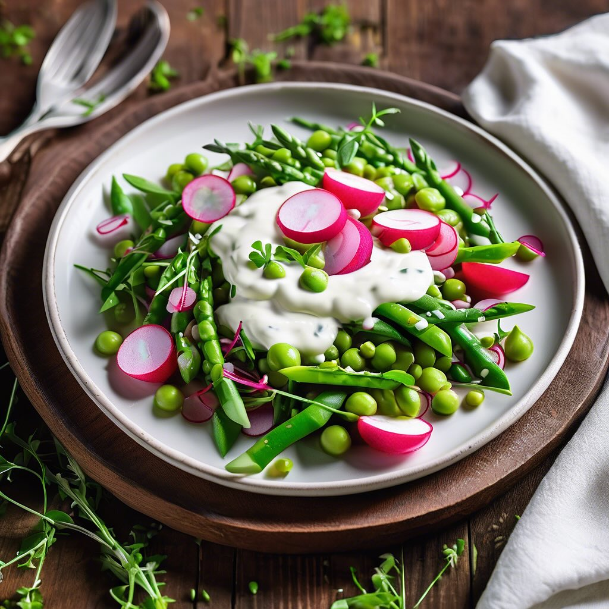

# ### Insalata di Piselli, Asparagi, Fave e Ravanelli #### Ingredienti: - 150 g di

### Insalata di Piselli, Asparagi, Fave e Ravanelli #### Ingredienti: - 150 g di piselli sbucciati come humus - 120 g di punte di asparagi - 350 g di fave - 100 g di ravanelli (circa 10) - 1 cipollotto fresco (o 2 se piccoli) - 100 g di spinaci - Olio extravergine di oliva q.b.. #### Procedimento: 1. **Preparazione dei piselli e delle fave**: In una pentola, porta a ebollizione dell’acqua salata. Aggiungi i piselli e le fave sbucciate e cuoci per circa 3-5 minuti, fino a quando sono teneri. Scolali e mettili in una ciotola di acqua ghiacciata per fermare la cottura e mantenere il colore. 2. **Cottura degli asparagi**: Nella stessa acqua, cuoci le punte di asparagi per circa 2-3 minuti, fino a quando sono tenere ma ancora croccanti. Scolale e raffreddale rapidamente in acqua ghiacciata. 3. **Preparazione dei ravanelli**: Lava e pulisci i ravanelli, poi tagliali a fette sottili o a metà, a seconda delle preferenze. 4. **Preparazione del cipollotto**: Affetta finemente il cipollotto fresco. 5. **Assemblaggio dell’insalata**: In una ciotola grande, unisci gli spinacini, i piselli, le fave, le punte di asparagi, i ravanelli e il cipollotto. Mescola delicatamente per combinare gli ingredienti. 6. **Condimento**: Condisci l’insalata con olio extravergine di oliva, sale e pepe a piacere. Mescola bene per distribuire il condimento. 7. **Servizio**: Servi l’insalata fresca come antipasto o contorno. Puoi anche aggiungere una spruzzata di limone per un tocco di freschezza.

---

*Ricetta da @leguminando*
