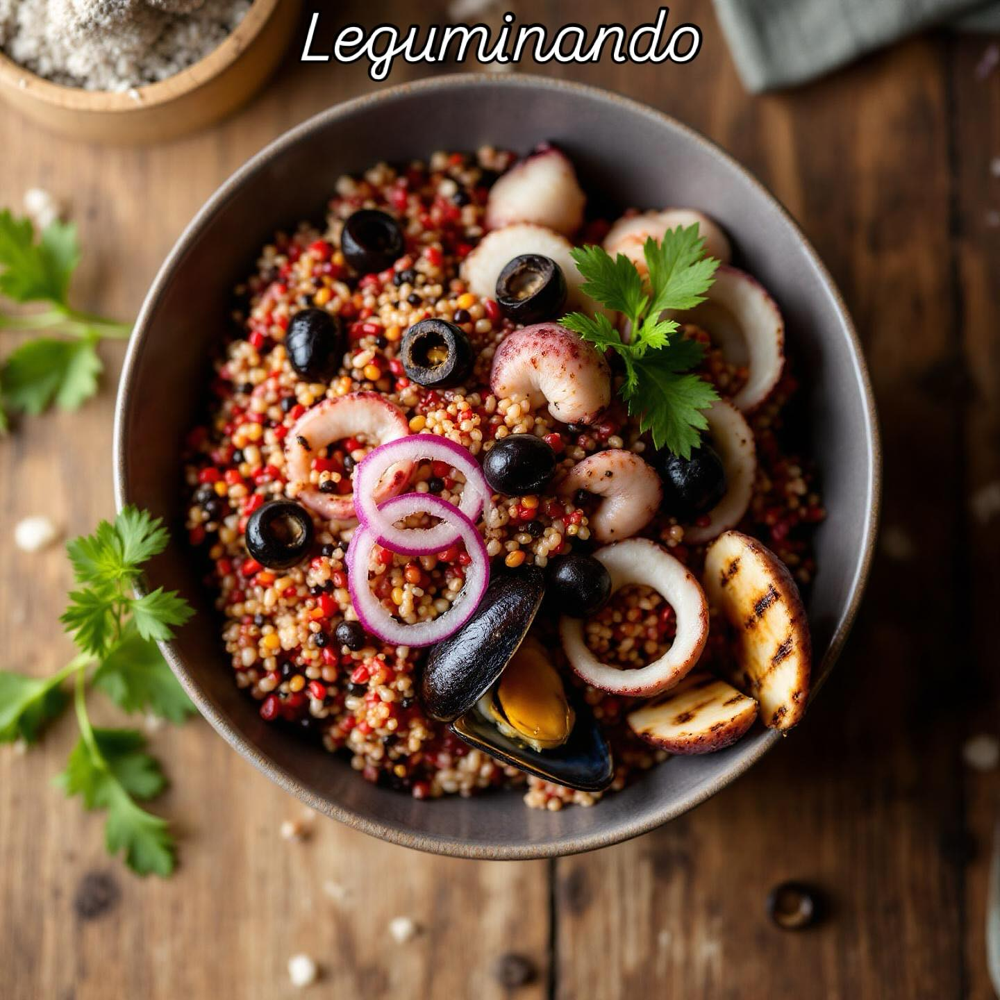

# ## Insalata di Quinoa Colorata con Cozze e Polpo alla Brace #### Ingredienti: - 

## Insalata di Quinoa Colorata con Cozze e Polpo alla Brace #### Ingredienti: - 100 g di quinoa rossa - 100 g di quinoa nera - 100 g di quinoa bianca - 200 g di cozze - 200 g di polpo - 50 g di olive nere denocciolate - 1 cipolla rossa piccola - 2 spicchi d’aglio - Un mazzetto di prezzemolo fresco - Olio extravergine d’oliva - Succo di limone - Sale e pepe q.b. #### Procedimento: 1. **Cottura della Quinoa:** - Sciacqua la quinoa sotto acqua corrente. Cuoci ogni tipo di quinoa in acqua bollente salata (rispettivamente per 12-15 minuti). Scola e lascia raffreddare. 2. **Preparazione del Polpo:** - Porta a ebollizione una pentola d’acqua con un po’ di sale. Cuoci il polpo per circa 30-40 minuti o finché non diventa tenero. Scola e lascia raffreddare. Una volta freddo, griglialo su una piastra calda per qualche minuto per ottenere una bella crosticina. Taglia a pezzi. 3. **Cottura delle Cozze:** - In una padella, scalda un filo d’olio con uno spicchio d’aglio schiacciato. Aggiungi le cozze e copri. Cuoci finché le cozze si aprono. Scolale e lascia raffreddare. 4. **Preparazione degli Ingredienti Freschi:** - Affetta finemente la cipolla rossa e trita l’aglio rimanente. Taglia le olive a rondelle e trita il prezzemolo. 5. **Assemblaggio:** - In una grande ciotola, unisci le tre tipologie di quinoa, il polpo grigliato, le cozze, la cipolla rossa, le olive e il prezzemolo. Condisci con olio extravergine d’oliva, succo di limone, sale e pepe a piacere. Mescola bene. 6. **Servizio:** - Lascia riposare in frigorifero per almeno 30 minuti prima di servire per far amalgamare i sapori. Servi l’insalata fredda e gustala!

---

*Ricetta da @leguminando*
