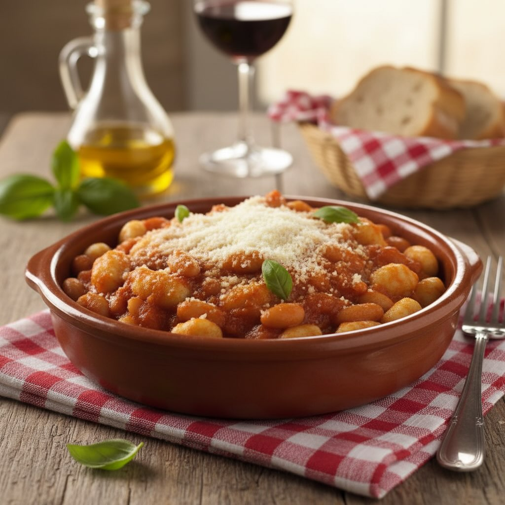

# #### Per i Pisarei: - 200 g di farina 00 - 100 g di pangrattato - Acqua tiepida 

#### Per i Pisarei: - 200 g di farina 00 - 100 g di pangrattato - Acqua tiepida q.b. - Un pizzico di sale # Per il Sugo: - 300 g di fagioli borlotti (già lessati) - 400 g di passata di pomodoro - 1 cipolla - 1 carota - 1 gambo di sedano - 2 foglie di alloro - 1 spicchio d&#039;ag’io - 50 g di pancetta (opzionale) - Olio extravergine d&#039;ol’va q.b. - Sale e pepe q.b. - Parmigiano Reggiano grattugiato per servire Preparazione: Preparare i Pisarei: 1. **Pangrattato:** In una ciotola, inumidisci il pangrattato con un po&#039; d&#039;acqua ’ l’scialo riposare per qualche minuto. 2. **Impasto:** Disponi la farina a fontana su una spianatoia, aggiungi il pangrattato al centro e un pizzico di sale. Impasta aggiungendo acqua tiepida poco alla volta, fino a ottenere un composto liscio e omogeneo. 3. **Formare i Pisarei:** Prendi piccoli pezzi di impasto e forma dei cilindri sottili. Taglia i cilindri a pezzetti di circa 1 cm e forma delle piccole palline. Premi ogni pallina con il pollice per ottenere la tipica forma concava. Preparare il Sugo: 1. **Soffritto:** Taglia finemente cipolla, carota, sedano e pancetta (se usata). In una padella capiente, scalda un filo d&#039;olio e soffri’gi il trito insieme all&#039;aglio. 2. **A’giungere i Fagioli:** Unisci i fagioli borlotti e le foglie di alloro, lasciando insaporire per qualche minuto. 3. **Cuocere il Sugo:** Versa la passata di pomodoro, aggiusta di sale e pepe, e cuoci a fuoco lento per circa 30 minuti, mescolando di tanto in tanto. Cuocere i Pisarei e Assemblare: 1. **Cuocere i Pisarei:** Porta a ebollizione una pentola d’acqua salata e cuoci i pisarei fino a quando non vengono a galla. 2. **Unire al Sugo:** Scola i pisarei e trasferiscili nella padella con il sugo. Mescola bene per amalgamare i sapori. 3. **Servire:** Servi i pisarei e faśö caldi, cosparsi di Parmigiano Reggiano grattugiato.

---

*Ricetta da @leguminando*
