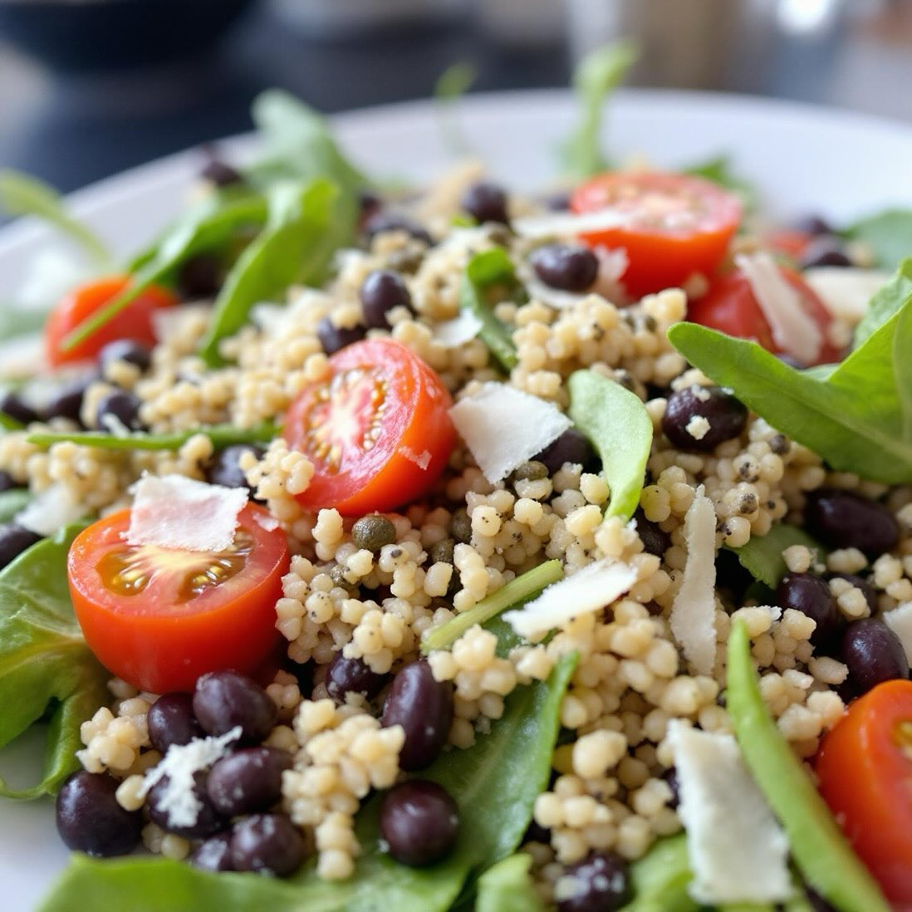

# ## Piatto Freddo di Quinoa con Rucola e Fagioli Neri **Ingredienti:** - 200 g di

## Piatto Freddo di Quinoa con Rucola e Fagioli Neri **Ingredienti:** - 200 g di quinoa - 100 g di rucola fresca - 50 g di parmigiano reggiano (a scaglie) - 200 g di pomodori ciliegia - 200 g di fagioli neri (cotti, in scatola o lessati) - 2 cucchiai di capperi - Olio d’oliva - Succo di limone - Sale e pepe a piacere **Preparazione:** 1. **Cottura della quinoa:** Sciacquate la quinoa sotto acqua corrente. Cuocetela in una pentola con il doppio del suo volume di acqua per circa 15 minuti, fino a quando non è tenera. Scolatela e lasciatela raffreddare. 2. **Preparazione degli ingredienti:** Nel frattempo, tagliate i pomodori ciliegia a metà e scolate i fagioli neri. In una ciotola grande, unite la quinoa raffreddata, i pomodori, i fagioli neri, la rucola e i capperi. 3. **Condimento:** In una ciotola a parte, mescolate l’olio d’oliva, il succo di limone, sale e pepe. Versate il condimento sull’insalata e mescolate bene. 4. **Presentazione:** Servite il piatto freddo in un grande piatto da portata, guarnendo con le scaglie di parmigiano. Adesso procederò a generare due immagini di presentazione del piatto.Ecco la ricetta per un delizioso piatto freddo a base di quinoa, rucola, parmigiano, pomodori, fagioli neri e capperi.

---

*Ricetta da @leguminando*
