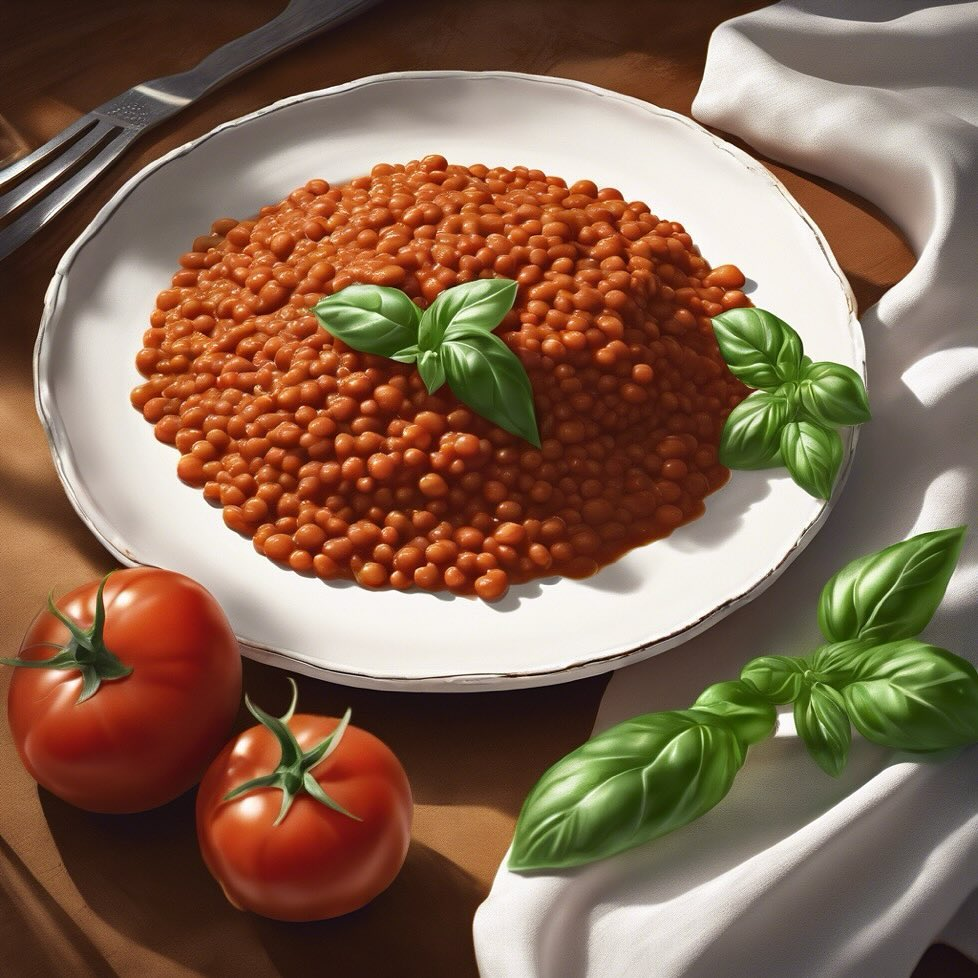

# Polpette di Lenticchie **Ingredienti:** - 250g di lenticchie - 1 carota grattugi

Polpette di Lenticchie **Ingredienti:** - 250g di lenticchie - 1 carota grattugiata - 1 cipolla tritata - 100g di pangrattato - Spezie a piacere **Preparazione:** 1. **Cottura delle lenticchie:** Cuoci le lenticchie in acqua salata fino a quando sono tenere. Scolale e lasciale raffreddare. 2. **Preparazione del composto:** In una ciotola, unisci le lenticchie, la carota grattugiata, la cipolla tritata e il pangrattato. Aggiungi spezie a piacere e mescola fino a ottenere un composto omogeneo. 3. **Formare le polpette:** Con le mani umide, forma delle polpette della dimensione desiderata. 4. **Cottura:** Scalda un po’ d’olio in una padella e cuoci le polpette per circa 5-6 minuti per lato, fino a quando sono dorate. 5. **Servizio:** Servi le polpette con una salsa di pomodoro o una salsa yogurt vegana. Sono ottime anche all’interno di un panino.

---

*Ricetta da @leguminando*
