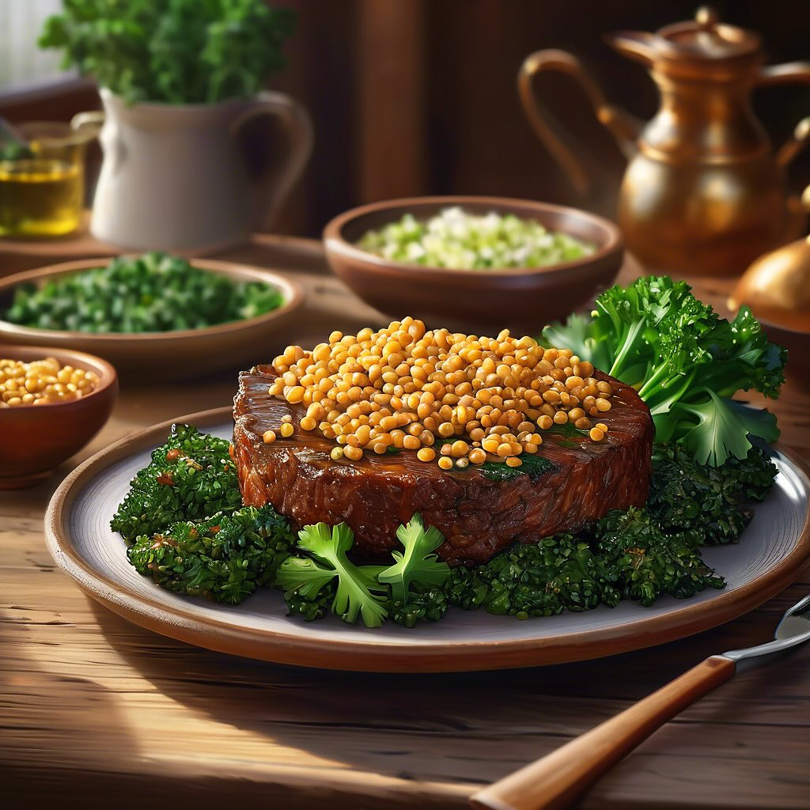

# ### Polpette di Lenticchie e Cavolo Nero #### Ingredienti: - 200 g di lenticchie

### Polpette di Lenticchie e Cavolo Nero #### Ingredienti: - 200 g di lenticchie verdi o marroni - 100 g di cavolo nero, tritato finemente - 2 spicchi d’aglio, tritati - 1 cipolla piccola, tritata - 50 g di pangrattato - 1 uovo (opzionale, per legare) - 1 cucchiaino di cumino in polvere - Sale e pepe q.b. - Olio d’oliva q.b. - Prezzemolo fresco, tritato (per guarnire) #### Procedimento: 1. **Preparare le lenticchie**: Cuocere le lenticchie in acqua salata per circa 20-30 minuti, fino a quando sono tenere. Scolarle e lasciarle raffreddare. 2. **Cuocere il cavolo nero**: In una padella, scaldare un filo d’olio d’oliva e aggiungere la cipolla e l’aglio. Soffriggere fino a quando diventano trasparenti. Aggiungere il cavolo nero tritato e cuocere per circa 5-7 minuti, finché non si ammorbidisce. Togliere dal fuoco e lasciare raffreddare. 3. **Unire gli ingredienti**: In una ciotola grande, unire le lenticchie cotte, il cavolo nero, il pangrattato, l’uovo (se utilizzato), il cumino, sale e pepe. Mescolare bene fino a ottenere un composto omogeneo. Se il composto risulta troppo umido, aggiungere un po’ più di pangrattato. 4. **Formare le polpette**: Prelevare piccole porzioni di composto e formare delle polpette delle dimensioni di una pallina da golf. 5. **Cottura**: Riscaldare un filo d’olio in una padella antiaderente. Cuocere le polpette a fuoco medio, girandole delicatamente, fino a quando sono dorate e croccanti su tutti i lati (circa 5-7 minuti). 6. **Servire**: Servire le polpette calde, guarnite con prezzemolo fresco. Ottime da sole o accompagnate da una salsa di yogurt o pomodoro.

---

*Ricetta da @leguminando*
