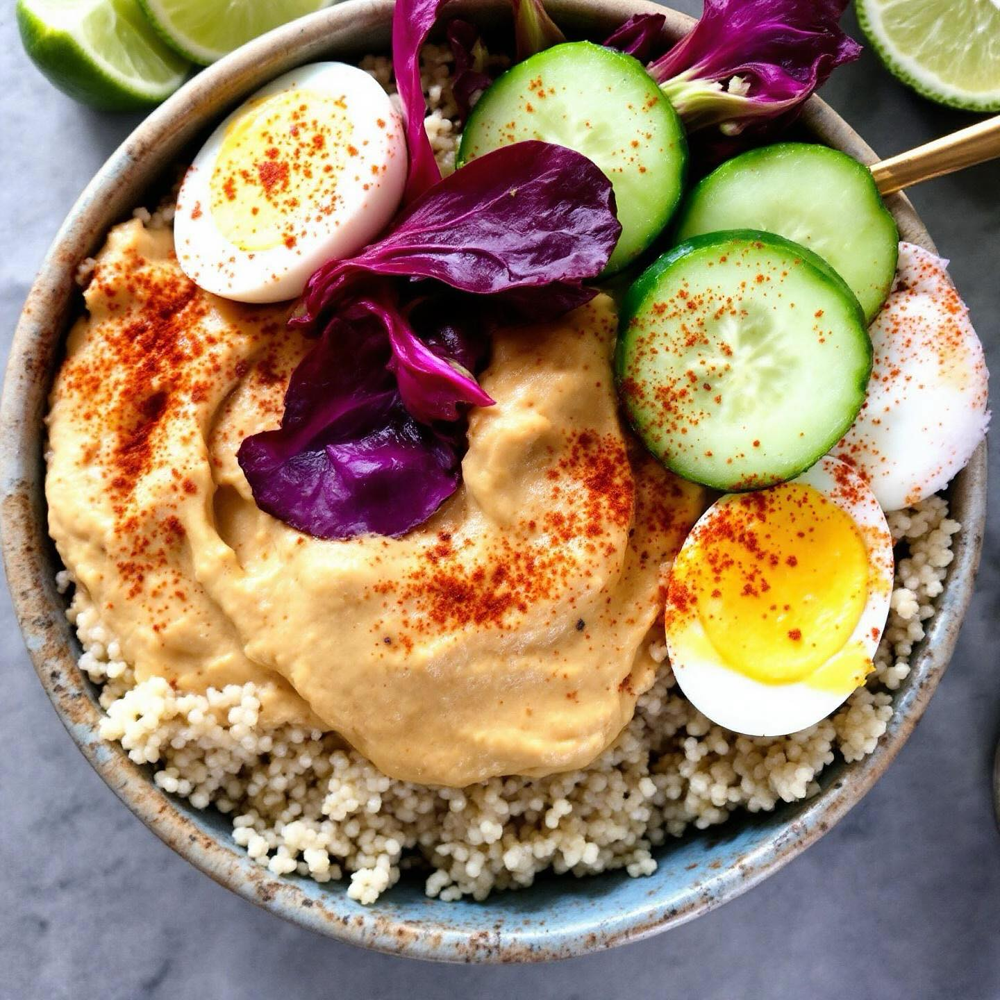

# ### Ricetta: Bowl di Quinoa con Hummus di Ceci, Radicchio e Uova Sode #### Descr

### Ricetta: Bowl di Quinoa con Hummus di Ceci, Radicchio e Uova Sode #### Descrizione del piatto: Questa bowl colorata e nutriente è un perfetto equilibrio di sapori e consistenze. La base di quinoa è arricchita da un cremoso hummus di ceci, aromatizzato con lime e aglio. Il radicchio rosso croccante aggiunge un tocco di amaro, mentre le uova sode offrono una fonte proteica extra. Infine, il cetriolo fresco dona una nota di freschezza al piatto, rendendolo ideale per un pranzo leggero o una cena estiva. #### Ingredienti: - 150 g di ceci (cotti e scolati) - 1 lime (succo e scorza) - 1 spicchio d’aglio - 100 g di quinoa - 1 cespo di radicchio rosso - 2 uova - 1 cetriolo - Olio extravergine d’oliva - Sale e pepe q.b. - Paprika (facoltativa, per guarnire) #### Procedimento: 1. **Preparazione dell’Hummus di Ceci:** - In un frullatore, metti i ceci, il succo e la scorza di lime, l’aglio e un pizzico di sale. Frulla fino ad ottenere una consistenza cremosa. Se necessario, aggiungi un po’ d’acqua o olio extravergine d’oliva per rendere l’hummus più liscio. Assaggia e aggiusta di sale e pepe. 2. **Cottura della Quinoa:** - Sciacqua la quinoa sotto acqua corrente. Cuoci in acqua bollente salata per circa 12-15 minuti. Scola e lascia raffreddare. 3. **Cottura delle Uova:** - Fai bollire le uova in acqua per circa 10 minuti per ottenere delle uova sode. Scola, raffredda sotto acqua fredda, quindi sgusciale e tagliale a metà. 4. **Preparazione degli Ingredienti Freschi:** - Lava e taglia il radicchio a striscioline. Lava il cetriolo e taglialo a rondelle. 5. **Assemblaggio della Bowl:** - In una ciotola, metti una base di quinoa. Aggiungi un generoso cucchiaio di hummus di ceci al centro. Disponi le striscioline di radicchio, le fette di cetriolo e le uova sode attorno all’hummus. Se desideri, spolvera con un po’ di paprika per decorare. 6. **Servizio:** - Drizza un filo d’olio extravergine d’oliva sopra e servi subito, accompagnato da spicchi di lime per un tocco di freschezza.

---

*Ricetta da @leguminando*
