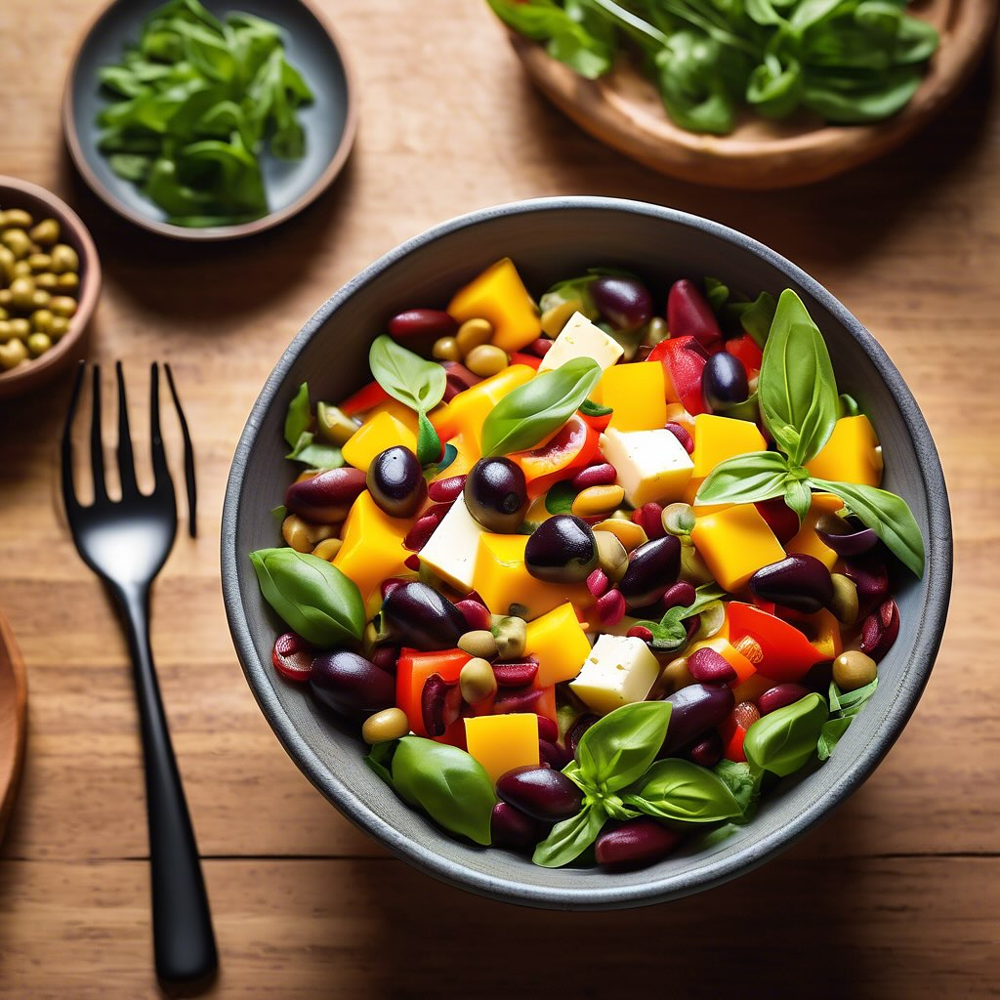

# ### Ricetta Estiva: Insalata di Primo Sale con Olive, Capperi, Acciughe, Peperon

### Ricetta Estiva: Insalata di Primo Sale con Olive, Capperi, Acciughe, Peperoni e Fagioli Rossi #### Ingredienti: - 200 g di formaggio primo sale, tagliato a cubetti - 100 g di olive nere o verdi, denocciolate e tagliate a rondelle - 30 g di capperi, sciacquati - 100 g di acciughe sott’olio, sgocciolate - 2 peperoni (uno rosso e uno giallo), tagliati a strisce - 200 g di fagioli rossi (cotti e scolati, o in scatola) - Olio extravergine d’oliva q.b. - Succo di limone q.b. - Sale e pepe q.b. - Basilico fresco, per guarnire #### Preparazione: 1. **Preparare i peperoni**: In una padella, scaldate un filo d’olio d’oliva e aggiungete le strisce di peperoni. Cuocete a fuoco medio per circa 5-7 minuti, finché non saranno teneri. Togliete dal fuoco e lasciate raffreddare. 2. **Comporre l’insalata**: In una ciotola grande, unite i cubetti di primo sale, le olive, i capperi, le acciughe, i peperoni raffreddati e i fagioli rossi. Mescolate delicatamente per amalgamare gli ingredienti. 3. **Condire**: In una ciotola a parte, emulsionate l’olio extravergine d’oliva, il succo di limone, sale e pepe. Versate il condimento sull’insalata e mescolate bene. 4. **Servire**: Presentate l’insalata in un piatto da portata e guarnitela con foglie di basilico fresco.

---

*Ricetta da @leguminando*
