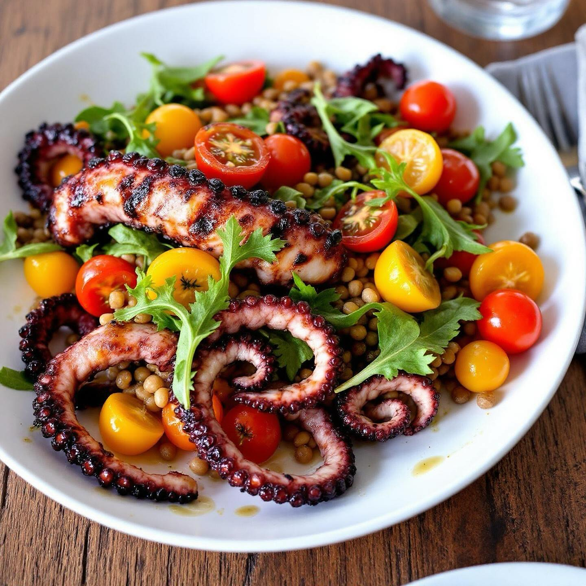

# ### Ricetta: Polpo alla Griglia con Rucola, Pomodori Rossi e Gialli, e Lenticchi

### Ricetta: Polpo alla Griglia con Rucola, Pomodori Rossi e Gialli, e Lenticchie #### Ingredienti: - 500 g di polpo fresco - 200 g di lenticchie (preferibilmente verdi o nere) - 100 g di rucola fresca - 150 g di pomodori rossi (tipo cuore di bue) - 150 g di pomodori gialli (tipo datterino) - Olio extravergine d’oliva - Succo di limone - Sale e pepe q.b. - Prezzemolo fresco tritato (facoltativo) #### Preparazione: 1. **Cottura delle lenticchie**: - Sciacqua le lenticchie sotto acqua corrente. Metti in un pentolino con abbondante acqua fredda e porta a ebollizione. Cuoci a fuoco medio per circa 20-25 minuti, o fino a quando sono tenere. Scola e lascia raffreddare. 2. **Preparazione del polpo**: - Porta a ebollizione una pentola d’acqua salata. Aggiungi il polpo e cuoci per circa 30-40 minuti, o fino a quando è tenero. Scola e lascia raffreddare. - Una volta freddo, taglia il polpo a pezzi. 3. **Grigliatura del polpo**: - Riscalda una griglia o una padella antiaderente. Spennella il polpo con un filo d’olio d’oliva e griglialo per circa 2-3 minuti per lato, fino a ottenere una leggera crosticina. 4. **Preparazione dell’insalata**: - Lava e asciuga la rucola. Taglia i pomodori rossi e gialli a cubetti. In una ciotola, unisci le lenticchie, i pomodori, la rucola e il polpo grigliato. Condisci con olio, succo di limone, sale e pepe. 5. **Impiattamento**: - Distribuisci l’insalata di polpo su piatti individuali. Puoi guarnire con prezzemolo tritato se desideri.

---

*Ricetta da @leguminando*
