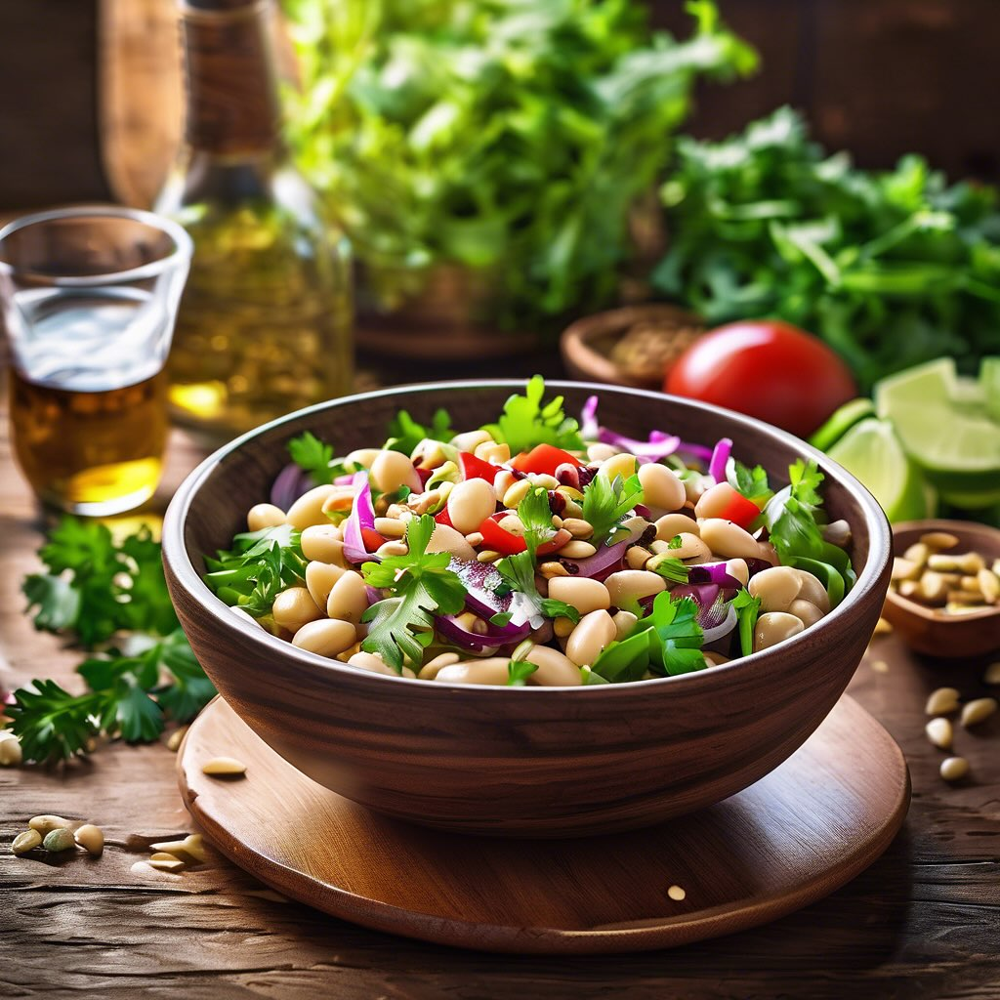

# ### Ricetta Rivisitata: Insalata di Fagioli Cannellini e Tonno con Pinoli e Pane

### Ricetta Rivisitata: Insalata di Fagioli Cannellini e Tonno con Pinoli e Pane Raffermo #### Ingredienti: - 300 g di fagioli dall’occhio (o fagioli cannellini, a seconda della preferenza) - 0,5 cipolla rossa, finemente affettata - 150 g di tonno - Prezzemolo fresco, tritato q.b. - Sale fino q.b. - Olio d’oliva q.b. - Aceto q.b. - 50 g di pinoli - 150 g di pane raffermo, tagliato a cubetti #### Preparazione: 1. **Preparare i fagioli**: Se utilizzate fagioli secchi, metteteli in ammollo per almeno 8 ore e poi lessateli in acqua salata finché non sono teneri. Se usate fagioli in scatola, scolateli e risciacquateli. 2. **Tostare i pinoli**: In una padella antiaderente, tostate i pinoli a fuoco medio per 2-3 minuti, mescolando frequentemente finché non diventano dorati. Metteteli da parte. 3. **Preparare il pane**: Nella stessa padella, aggiungete un filo d’olio e fate rosolare i cubetti di pane raffermo fino a quando non sono dorati e croccanti. Togliete dal fuoco e lasciate raffreddare. 4. **Comporre l’insalata**: In una ciotola grande, unite i fagioli, la cipolla rossa, il tonno sbriciolato, i pinoli tostati e il prezzemolo tritato. Mescolate delicatamente per amalgamare gli ingredienti. 5. **Condire**: In una ciotola a parte, emulsionate olio d’oliva, aceto, sale e pepe. Versate il condimento sull’insalata e mescolate bene. 6. **Aggiungere il pane**: Poco prima di servire, incorporate i cubetti di pane croccante per mantenerli croccanti. 7. **Servire**: Presentate l’insalata in un piatto da portata, guarnita con qualche foglia di prezzemolo fresco e una spolverata di pinoli.

---

*Ricetta da @leguminando*
