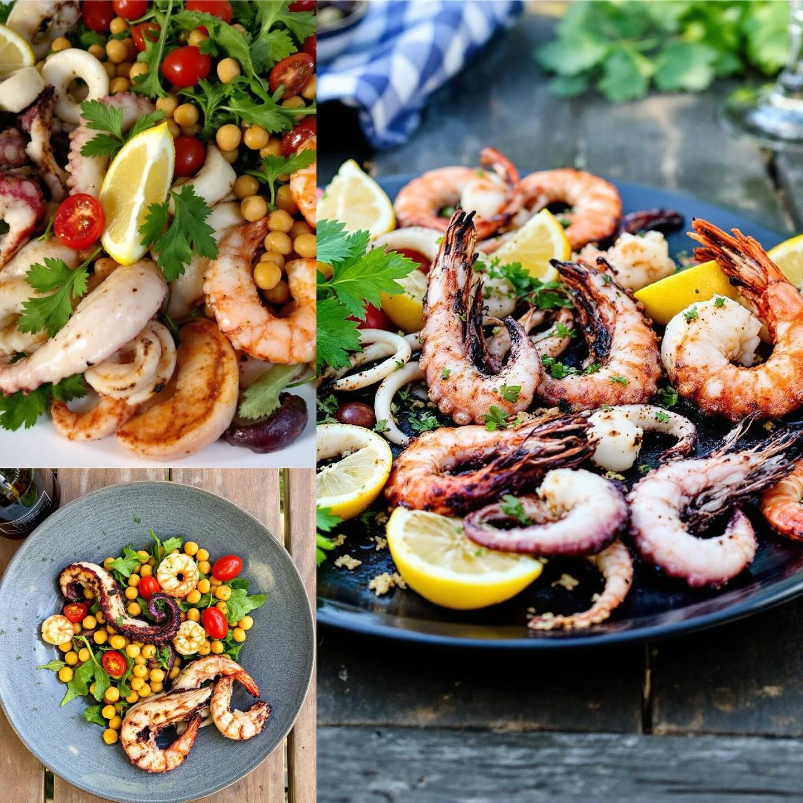

# ## Secondo Piatto: Grigliata di Polpi, Calamari e Gamberi ### Piatto Unico: Insa

## Secondo Piatto: Grigliata di Polpi, Calamari e Gamberi ### Piatto Unico: Insalata di Ceci, Rucola e Pomodori **Ingredienti:** - 500 g di polpo - 500 g di calamari - 300 g di gamberi - Olio d’oliva - Succo di limone - Aglio (2 spicchi) - Prezzemolo fresco tritato - Sale e pepe a piacere - Paprika dolce (opzionale) **Preparazione:** 1. **Pulizia del pesce:** Pulite il polpo e i calamari, rimuovendo le interiora e la pelle. Pulite i gamberi rimuovendo il carapace e il filo intestinale. 2. **Marinatura:** In una ciotola, mescolate l’olio d’oliva, il succo di limone, l’aglio tritato, il prezzemolo, sale, pepe e paprika. Aggiungete il polpo, i calamari e i gamberi, mescolando bene per far insaporire. Lasciate marinare in frigorifero per almeno 30 minuti. 3. **Grigliatura:** Scaldate la griglia a fuoco medio-alto. Iniziate a grigliare il polpo per circa 5-6 minuti per lato, finché non è tenero e leggermente croccante. Grigliate i calamari per 2-3 minuti per lato e i gamberi fino a quando diventano rosa (circa 2-3 minuti). 4. **Servizio:** Servite i frutti di mare grigliati ben caldi, guarniti con prezzemolo fresco e una spruzzata di succo di limone. **Ingredienti:** - 400 g di ceci cotti (in scatola o lessati) - 100 g di rucola fresca - 200 g di pomodori ciliegia - Olio d’oliva - Aceto balsamico - Sale e pepe a piacere **Preparazione:** 1. **Preparazione dell’insalata:** In una ciotola, unire i ceci, la rucola e i pomodori tagliati a metà. 2. **Condimento:** In una ciotola a parte, emulsionate l’olio d’oliva, l’aceto balsamico, il sale e il pepe. Versate il condimento sull’insalata e mescolate bene. 3. **Servizio:** Servite l’insalata fresca come contorno alla grigliata.

---

*Ricetta da @leguminando*
