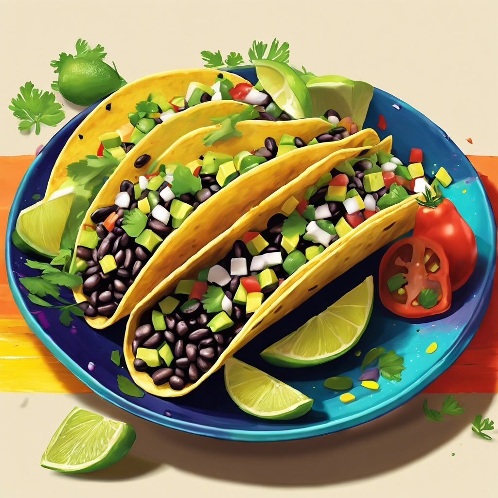

# Tacos di Fagioli **Ingredienti:** - 400g di fagioli neri - Tortillas - 1 avocado

Tacos di Fagioli **Ingredienti:** - 400g di fagioli neri - Tortillas - 1 avocado - Salsa di pomodoro **Preparazione:** 1. **Preparazione dei fagioli:** Se utilizzi fagioli secchi, cuocili in acqua salata fino a quando sono teneri. Se utilizzi fagioli in scatola, scolali e risciacquali. 2. **Preparazione delle tortillas:** Scalda le tortillas in una padella o nel microonde fino a quando sono morbide e calde. 3. **Assemblaggio dei tacos:** Riempi le tortillas con i fagioli neri, l’avocado a fette e la salsa di pomodoro. Aggiungi spezie a piacere. 4. **Servizio:** Servi i tacos caldi, accompagnati da lime e coriandolo fresco.

---

*Ricetta da @leguminando*
