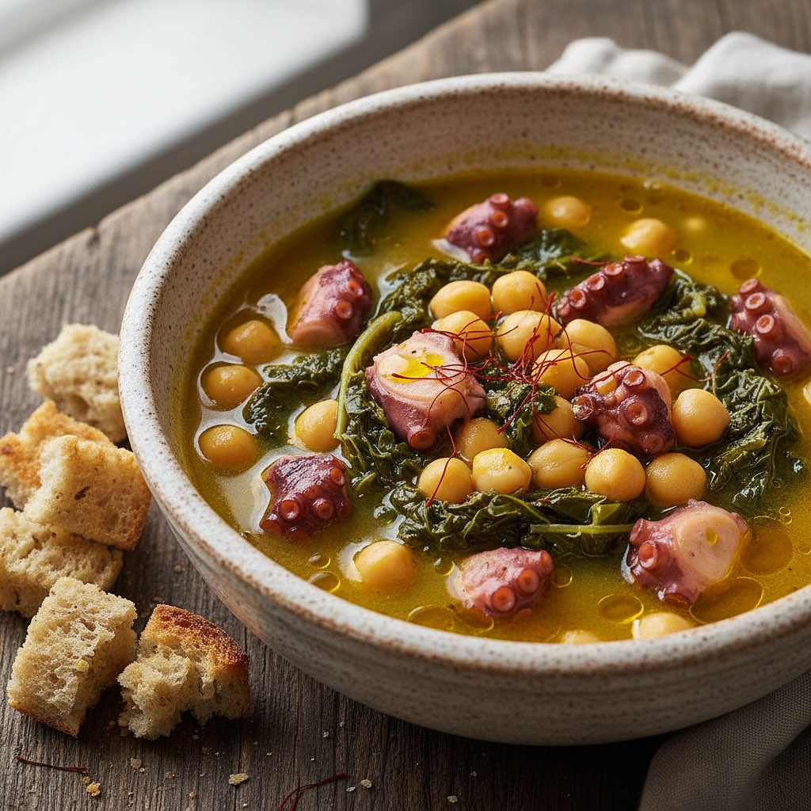

# Tempo totale Ammollo cicerchie o ceci 12 h + preparazione 20 min + cottura 1 h 3

Tempo totale Ammollo cicerchie o ceci 12 h + preparazione 20 min + cottura 1 h 30 min Ingredienti • 600 g di polpo (fresco o surgelato scongelato) • 200 g di cicerchie secche o ceci secchi • 300 g di foglie di cavolo nero • 1 cipolla piccola, 1 costa di sedano, 1 carota • 2 spicchi d’aglio, 1 peperoncino (facoltativo) • 1 bicchiere di vino bianco secco • 400 ml di passata di pomodoro • 4 cucchiai di olio extravergine d’oliva • Sale, pepe q.b. • Prezzemolo fresco tritato Preparazione 1. Ammollo e cottura cicerchie o ceci Metti le cicerchie in acqua fredda per 12 h. Scolale, sciacquale e cuoci in acqua non salata per circa 1 h, finché diventano tenere. 2. Brasatura del polpo Pulisci il polpo (occhi, becco, tentacoli). In una pentola scalda 2 cucchiai d’olio con aglio e peperoncino, rosola 1–2 min, unisci il polpo, sfuma col vino, aggiungi 200 ml d’acqua calda, copri e cuoci 45–50 min. Sala a fine cottura. 3. Umido di cicerchie In un’altra casseruola scalda 1 cucchiaio d’olio, fai appassire cipolla, sedano e carota tritati per 5 min. Aggiungi la passata, sala e cuoci 10 min. Unisci le cicerchie, mescola, copri e cuoci altri 5–10 min. 4. Cavolo nero croccante Elimina la costa centrale, taglia le foglie a listarelle. In padella scalda 1 cucchiaio d’olio e salta il cavolo a fiamma viva 4–5 min. 5. Impiattamento Stendi un nido di cicerchie in umido, adagia i tentacoli a pezzi, completa con cavolo nero, un filo d’olio, prezzemolo e pepe. Suggerimenti • Raffredda il polpo nel suo liquido per renderlo più morbido. • Sostituisci la passata con pomodorini pachino a metà per un gusto più fresco. • Accompagna con Vermentino toscano o Pinot Grigio friulano.

---

*Ricetta da @leguminando*
