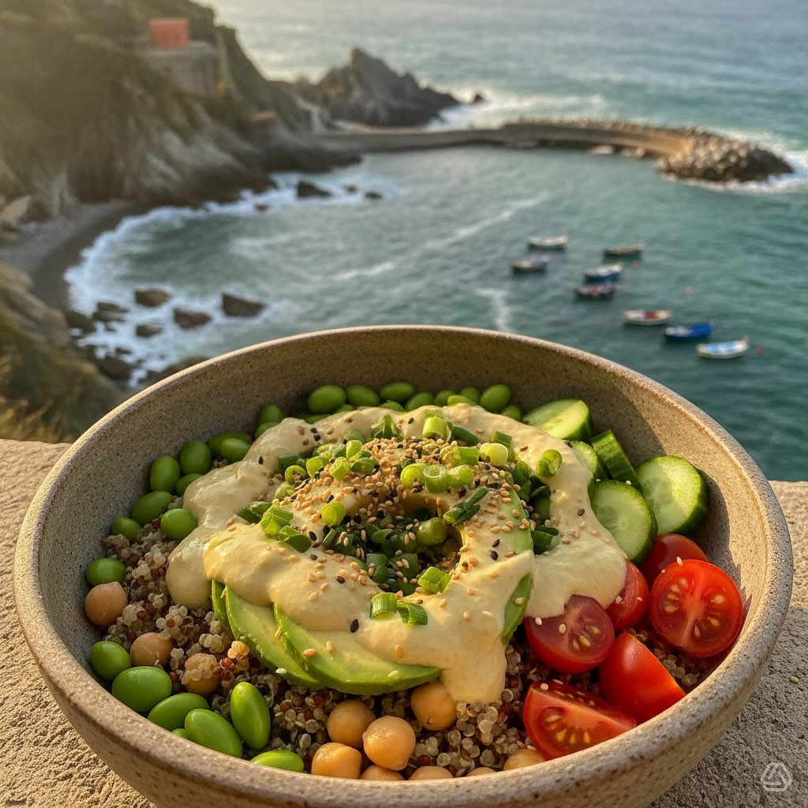

# #leguminando **Bowl Estivo Quinoa &amp; Ceci con Avocado e Dressing al Lime** Un

#leguminando **Bowl Estivo Quinoa &amp; Ceci con Avocado e Dressing al Lime** Un piatto unico fresco e nutriente, perfetto per l’estate! ☀️ **Ingredienti per 4 persone:** - **Base:** - 240 g di quinoa - 400 g di ceci precotti - 200 g di edamame - **Dressing al lime e tahini:** - 60 ml di tahini - 60 ml di succo di lime - 3 g di zenzero e aglio - 30 ml di olio evo - **Toppings:** - 300 g di avocado - 200 g di pomodorini ciliegino - 150 g di cetrioli - 80 g di germogli **Preparazione:** 1. **Cuoci la Quinoa:** Porta a bollore 480 ml d’acqua con la quinoa e cuoci per 15 minuti. Lascia raffreddare. 2. **Prepara Ceci ed Edamame:** Sgocciola e risciacqua i ceci. Cuoci gli edamame per pochi minuti. 3. **Dressing:** Mescola tahini, succo di lime, zenzero, aglio e olio evo fino a ottenere una salsa fluida. 4. **Toppings:** Prepara avocado, pomodorini, cetrioli e germogli. 5. **Assemblaggio:** Componi la bowl con quinoa, ceci, edamame e toppings. Condisci con il dressing e servi con erba cipollina e semi di sesamo. Un’esplosione di sapori estivi in ogni boccone! 🍃

---

*Ricetta da @leguminando*
