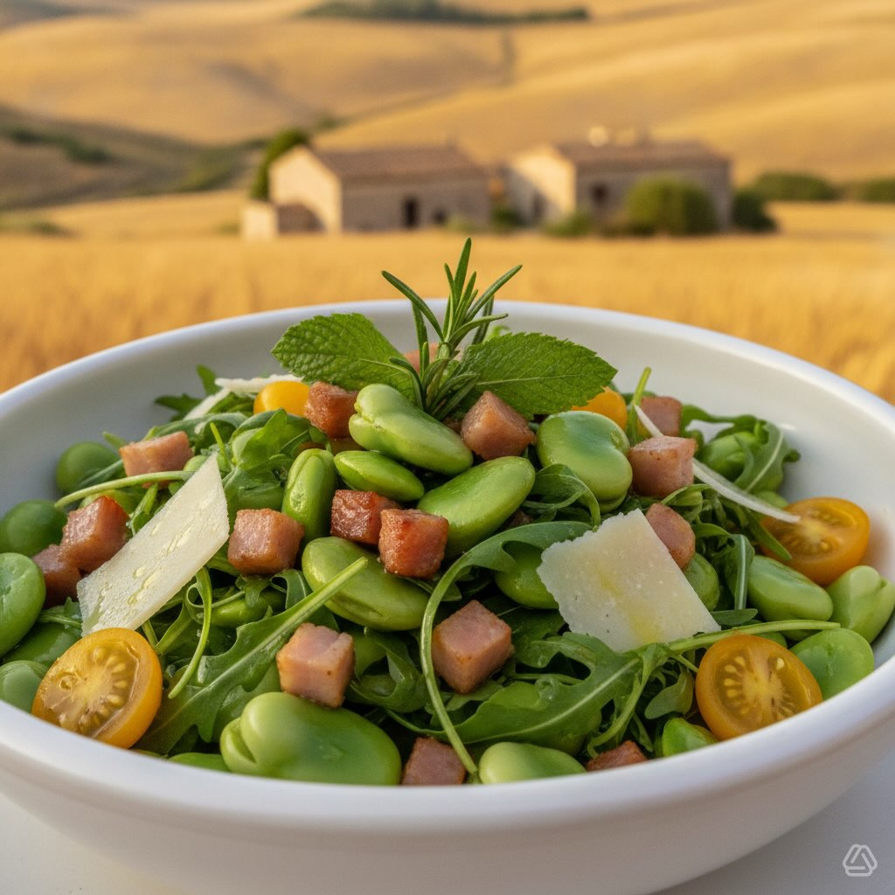

# #leguminando Insalata Estiva di Fave con Rosmarino, Cipolla e Pancetta Croccante

#leguminando Insalata Estiva di Fave con Rosmarino, Cipolla e Pancetta Croccante Le fave erano il cuore dell’alimentazione etrusca: i baccelli venivano raccolti a primavera e consumati freschi con cipolla, erbe aromatiche e pancetta. Gli Etruschi, raffinati buongustai, plasmarono i principi della cucina mediterranea — olio, legumi, erbe selvatiche — che ancora oggi definiscono il gusto dell’Italia. **Stagione:** Giugno (estate) **Tipo:** Insalata / Piatto unico freddo **Porzioni:** 4 persone **Tempo preparazione:** 20 minuti **Tempo cottura:** 10 minuti **Difficoltà:** Facile ## Ingredienti (con quantità precise) ## Per le fave: - **Fave fresche in baccello:** 1 kg (peso lordo) → circa 300-350 g di fave sgusciate - **Acqua per sbollentare:** 2 litri - **Sale:** 1 cucchiaino (5 g) Per la pancetta croccante: - **Pancetta dolce (o guanciale):** 120 g, a dadini piccoli (0,5 cm) - **Olio extravergine d&#039;oli’a:** 1 cucchiaio (15 ml), solo se necessario (la pancetta rilascia grasso) - **Pepe nero:** q.b. Per il condimento: - **Olio extravergine d&#039;oliva:’* 4 cucchiai (60 ml) - **Aceto di vino bianco:** 2 cucchiai (30 ml) - **Succo di limone fresco:** 2 cucchiai (30 ml) - **Aglio:** 1 spicchio piccolo (5 g), tritato finemente o schiacciato - **Rosmarino fresco:** 2 rametti (10 g), aghi tritati finemente - **Sale marino:** 1/2 cucchiaino (2 g) - **Pepe nero macinato fresco:** 1/2 cucchiaino (1 g) - **Scorza di limone non trattato:** 1/2 cucchiaino (1 g), grattugiata Per l’insalata finale: - **Cipolla rossa:** 1 piccola (80 g), affettata sottilmente a mezzelune - **Rucola selvatica:** 80 g - **Pomodorini ciliegino gialli:** 150 g, tagliati a metà - **Parmigiano Reggiano (o Pecorino Romano):** 50 g, scaglie sottili - **Noci tostate:** 30 g, spezzate grossolanamente - **Menta fresca:** 8 foglie, per guarnire

---

*Ricetta da @leguminando*
