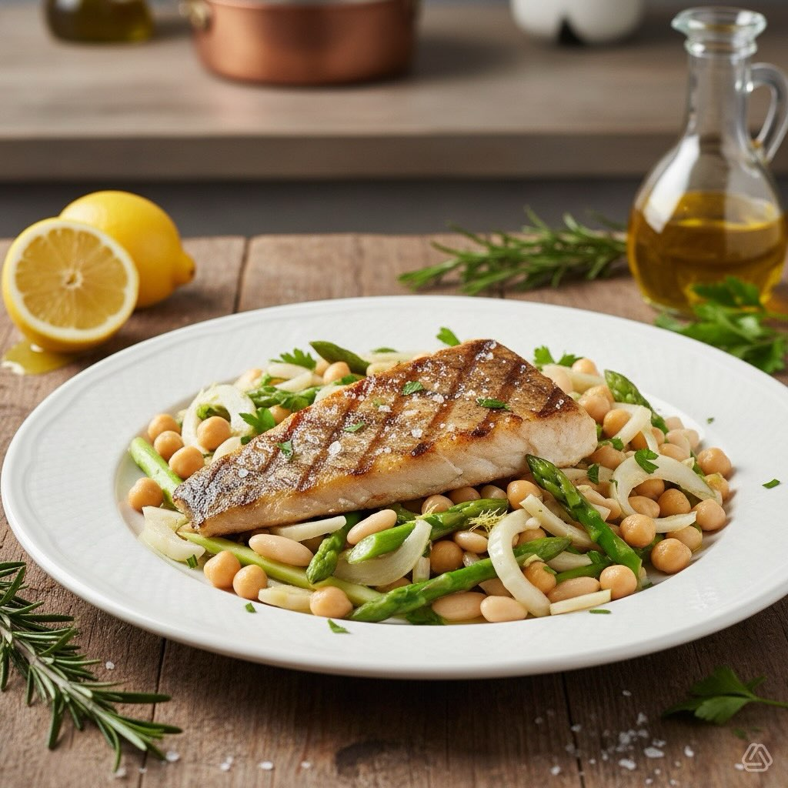

# #leguminando Questo piatto combina il sapore affumicato dello stoccafisso con la

#leguminando Questo piatto combina il sapore affumicato dello stoccafisso con la freschezza e croccantezza dei legumi e delle verdure, creando un equilibrio perfetto di sapori e consistenze. **Stoccafisso alla Brace con Insalata di Legumi, Finocchio e Asparagi** #### Ingredienti - **Per lo stoccafisso:** - 600 g di stoccafisso ammollato - Olio extravergine d’oliva - Succo di un limone - Sale e pepe q.b. - Un rametto di rosmarino - **Per l’insalata di legumi:** - 200 g di ceci lessati - 200 g di fagioli cannellini lessati - 1 finocchio, affettato sottilmente - 150 g di asparagi, tagliati a pezzi e sbollentati - 1 cipolla rossa, affettata finemente - Succo di mezzo limone - Olio extravergine d’oliva - Sale e pepe q.b. - Prezzemolo fresco tritato Preparazione 1. **Prepara lo stoccafisso:** - Preriscalda la griglia. - Asciuga lo stoccafisso e condiscilo con olio d&#039;oli’a, succo di limone, sale, pepe e rosmarino. - Cuoci lo stoccafisso sulla griglia per circa 5-7 minuti per lato, fino a quando è ben dorato e cotto all&#039;int’rno. 2. **Prepara l&#039;ins’lata di legumi:** - In una ciotola grande, unisci i ceci e i fagioli cannellini. - Aggiungi il finocchio affettato, gli asparagi sbollentati e la cipolla rossa. - Condisci con succo di limone, olio d&#039;oli’a, sale, pepe e prezzemolo. Mescola bene. 3. **Assemblaggio:** - Disponi lo stoccafisso grigliato su un piatto da portata. - Servi con l&#039;ins’lata di legumi, finocchio e asparagi accanto. 4. **Servizio:** - Decora il piatto con qualche foglia di prezzemolo fresco e un filo d&#039;oli’ d’oliva. - Servi immediatamente.

---

*Ricetta da @leguminando*
