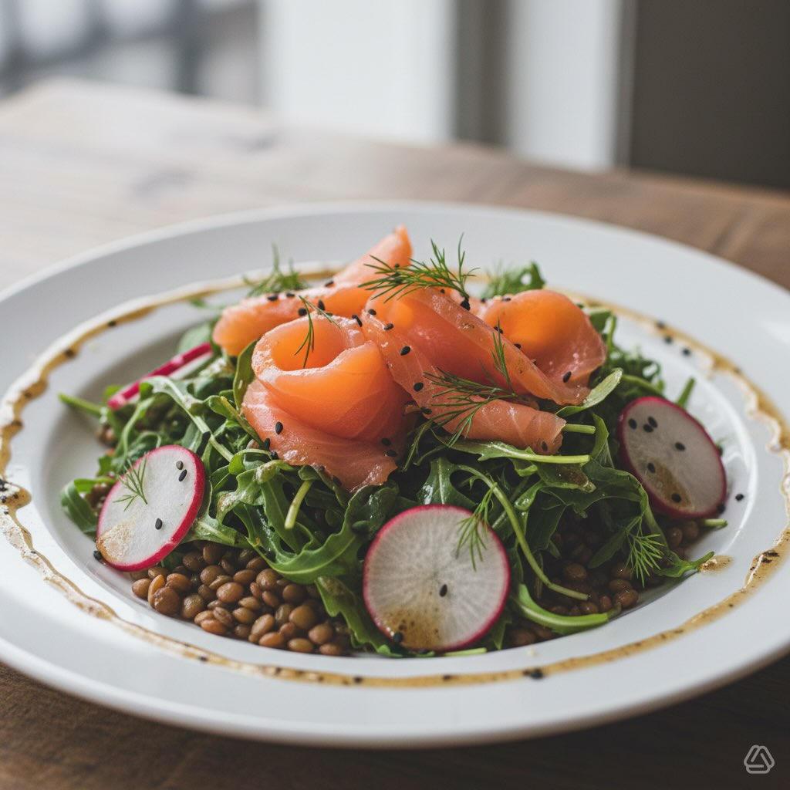

# #leguminando #### Ingredienti (per 2 persone) * **150 g** di salmone affumicato 

#leguminando #### Ingredienti (per 2 persone) * **150 g** di salmone affumicato di buona qualità * **100 g** di rucola fresca * **200 g** di lenticchie (preferibilmente piccole, come quelle di Puy o Beluga), già cotte * **8-10** ravanelli * **1/2** cipolla rossa di Tropea (facoltativa) * Aneto fresco (qualche rametto, per guarnire) Per il condimento (Vinaigrette al limone e senape) * **4 cucchiai** di olio extra vergine d&#039;oli’a * **2 cucchiai** di succo di limone fresco * **1 cucchiaino** di senape di Digione * **Sale** q.b. * **Pepe nero** macinato fresco q.b. Procedimento 1. **Prepara gli ingredienti:** * Lava accuratamente la rucola e i ravanelli. Asciuga bene la rucola. * Taglia i ravanelli a fettine molto sottili. Se usi la cipolla, affettala finemente. * Se le lenticchie sono in scatola, scolale dal loro liquido di conservazione e sciacquale sotto acqua corrente. Lasciale scolare bene. * Taglia il salmone affumicato a listarelle o spezzettalo grossolanamente. 2. **Prepara il condimento:** * In una piccola ciotola o in un barattolo con coperchio, unisci l&#039;olio d&#039;oliva, succo di limone e la senape di Digione. * Aggiungi un pizzico di sale e una generosa macinata di pepe nero. * Emulsiona energicamente con una forchetta o agitando il barattolo fino a ottenere una salsa omogenea. 3. **Assembla l’insalata’:** * In una ciotola capiente, unisci la rucola, le lenticchie ben scolate, i ravanelli a fettine e la cipolla (se la usi). * Versa circa metà del condimento sugli ingredienti e mescola delicatamente per distribuirlo in modo uniforme. * Disponi l&#039;insalata così condita sui piatti da portata. * Adagia sopra le fette di salmone affumicato. 4. **Completa e servi:** * Irrora il salmone e il resto dell’insalata con il condimento rimasto. * Guarnisci con qualche ciuffetto di aneto fresco. * Servi immediatamente.

---

*Ricetta da @leguminando*
