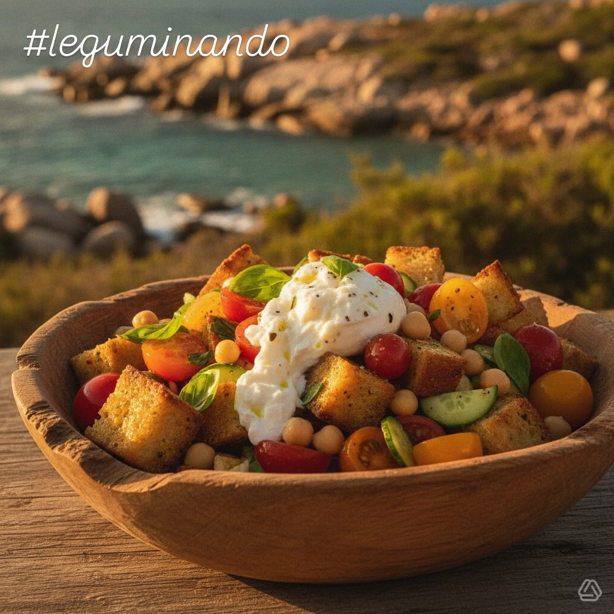

# #leguminando ### Ingredienti per la Panzanella Estiva **Base:** - Ceci precotti:

#leguminando ### Ingredienti per la Panzanella Estiva **Base:** - Ceci precotti: 500 g - Pane raffermo: 300 g, a cubetti - Olio extravergine d’oliva: 3 cucchiai **Pomodorini e Verdure:** - Pomodorini rossi: 300 g - Pomodorini gialli: 200 g - Pomodorini arancioni/verdi: 150 g (opzionale) - Cipolla rossa: 1 piccola, affettata - Cetrioli: 2 medi, a rondelle - Peperoncino fresco: 1/2 (opzionale) **Condimento:** - Olio extravergine d’oliva: 6 cucchiai - Aceto di vino bianco: 3 cucchiai - Aglio: 1 spicchio, tritato - Basilico fresco: 1 mazzetto - Sale marino: 1 cucchiaino - Pepe nero: 1/2 cucchiaino - Zucchero di canna: 1/2 cucchiaino (opzionale) **Finitura (opzionale):** - Stracciatella di burrata: 200 g - Olive taggiasche: 80 g - Capperi: 2 cucchiai - Scorza di limone: 1/2 cucchiaino - Fior di sale e olio EVO a crudo. Perfetto per un piatto estivo fresco e saporito!

---

*Ricetta da @leguminando*
