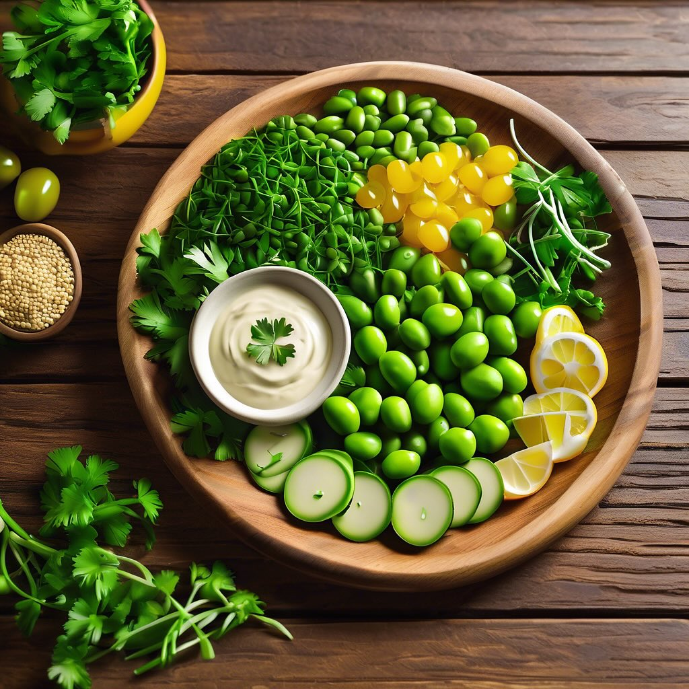

# ### Antipasto di Fave e Cicerchie #### Ingredienti: - 200 g di fave fresche o su

### Antipasto di Fave e Cicerchie #### Ingredienti: - 200 g di fave fresche o surgelate - 200 g di cicerchie (secche o in scatola) - 1 cipolla piccola - 2 spicchi d’aglio - 3 cucchiai di olio extravergine d’oliva - Succo di 1 limone - Sale e pepe q.b. - Prezzemolo fresco tritato - Peperoncino (facoltativo) #### Procedimento: 1. **Preparazione delle cicerchie**: Se utilizzi cicerchie secche, mettile a bagno in acqua per almeno 12 ore. Scolale e cuocile in acqua salata per circa 1-2 ore, fino a quando sono tenere. Se usi cicerchie in scatola, scolale e risciacquale bene. 2. **Cottura delle fave**: Se usi fave fresche, sbucciale e cuocile in acqua salata per circa 5-7 minuti, fino a quando sono tenere. Se usi fave surgelate, cuocile direttamente secondo le istruzioni sulla confezione. 3. **Soffritto**: In una padella, scalda l’olio d’oliva e aggiungi la cipolla tritata e gli spicchi d’aglio schiacciati. Fai soffriggere a fuoco medio finché la cipolla diventa trasparente. 4. **Unire gli ingredienti**: Aggiungi le fave e le cicerchie nella padella. Mescola bene e cuoci per altri 5 minuti. Aggiusta di sale e pepe e, se desideri, aggiungi un pizzico di peperoncino. 5. **Condire**: Togli dal fuoco e aggiungi il succo di limone e il prezzemolo tritato. Mescola bene per amalgamare i sapori. 6. **Servire**: Puoi servire l’antipasto caldo o a temperatura ambiente. Presenta il piatto in una ciotola, decorando con qualche foglia di prezzemolo fresco.

---

*Ricetta da @leguminando*
