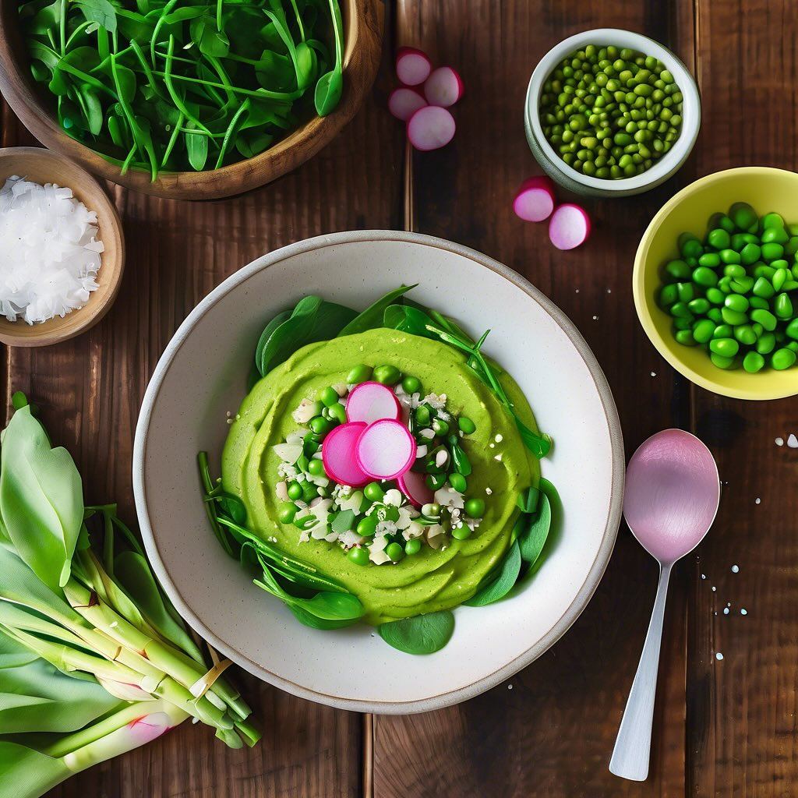

# ### Antipasto di Lenticchie con Porri, Asparagi e Gamberetti #### Ingredienti: -

### Antipasto di Lenticchie con Porri, Asparagi e Gamberetti #### Ingredienti: - 200 g di lenticchie verdi - 2 porri - 200 g di asparagi - 250 g di gamberetti sgusciati - 1 spicchio d’aglio - 3 cucchiai di olio d’oliva - Sale e pepe q.b. - Succo di limone (facoltativo) - Prezzemolo fresco per guarnire #### Procedimento: 1. **Preparazione delle lenticchie**: Inizia sciacquando le lenticchie sotto acqua corrente. Cuocile in una pentola con abbondante acqua salata per circa 20-25 minuti, o fino a quando sono tenere. Scolale e mettile da parte. 2. **Cottura dei porri**: Pulisci i porri, affettali finemente e soffriggili in una padella con 2 cucchiai di olio d’oliva e lo spicchio d’aglio schiacciato. Cuoci a fuoco medio fino a quando i porri diventano morbidi. 3. **Cottura degli asparagi**: Pulisci e taglia gli asparagi a pezzetti di circa 3-4 cm. Aggiungili nella padella con i porri e cuocili per circa 5-7 minuti, fino a quando sono teneri ma ancora croccanti. Aggiusta di sale e pepe. 4. **Cottura dei gamberetti**: In un’altra padella, scalda un cucchiaio di olio d’oliva e aggiungi i gamberetti. Cuoci per 3-4 minuti, fino a quando diventano rosa e opachi. Aggiusta di sale e pepe a piacere. 5. **Assemblaggio del piatto**: In una ciotola grande, mescola le lenticchie cotte, i porri e gli asparagi. Aggiungi i gamberetti e mescola delicatamente. 6. **Servizio**: Servi l’antipasto caldo o a temperatura ambiente. Puoi guarnire con un filo d’olio d’oliva e un po’ di succo di limone per un tocco di freschezza. Completa con prezzemolo fresco tritato.

---

*Ricetta da @leguminando*
