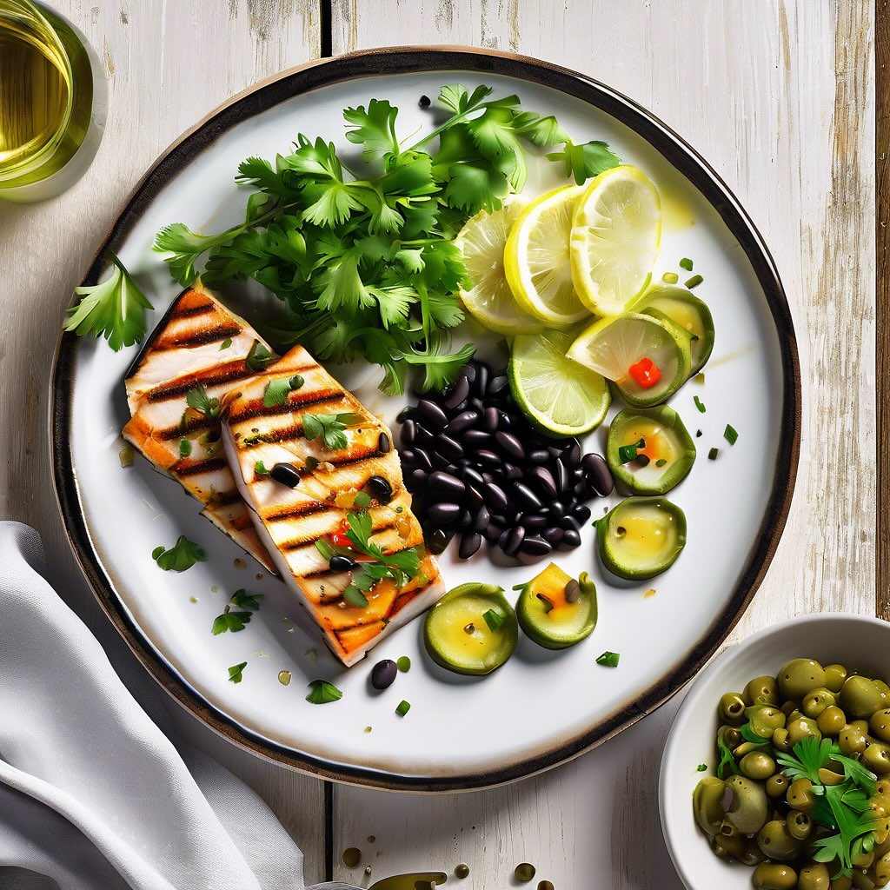

# ### Antipasto di Pesce Spada con Fagioli Neri e Olive #### Ingredienti: - 300 g 

### Antipasto di Pesce Spada con Fagioli Neri e Olive #### Ingredienti: - 300 g di pesce spada (a fette) - 200 g di fagioli neri (cotti, se in scatola) - 100 g di olive verdi denocciolate - 2 cucchiai di capperi - 2 spicchi d’aglio - 3 cucchiai di olio extravergine d’oliva - Succo di 1 limone - Sale e pepe q.b. - Prezzemolo fresco tritato (per guarnire) #### Procedimento: 1. **Preparare il pesce spada**: - In una padella, scaldare 2 cucchiai di olio d’oliva. Aggiungere gli spicchi d’aglio schiacciati e lasciarli dorare leggermente. - Aggiungere le fette di pesce spada e cuocerle per circa 3-4 minuti per lato, fino a quando sono ben dorate. Salare e pepare a piacere. 2. **Preparare i fagioli**: - In una ciotola, unire i fagioli neri cotti, le olive verdi tagliate a rondelle e i capperi. Aggiungere un cucchiaio di olio d’oliva e il succo di limone. Mescolare bene. 3. **Assemblare il piatto**: - Su un piatto da portata, disporre le fette di pesce spada calde. Sopra, aggiungere il mix di fagioli, olive e capperi. 4. **Guarnire e servire**: - Cospargere con prezzemolo fresco tritato e un filo d’olio d’oliva. Servire l’antipasto caldo o a temperatura ambiente.

---

*Ricetta da @leguminando*
