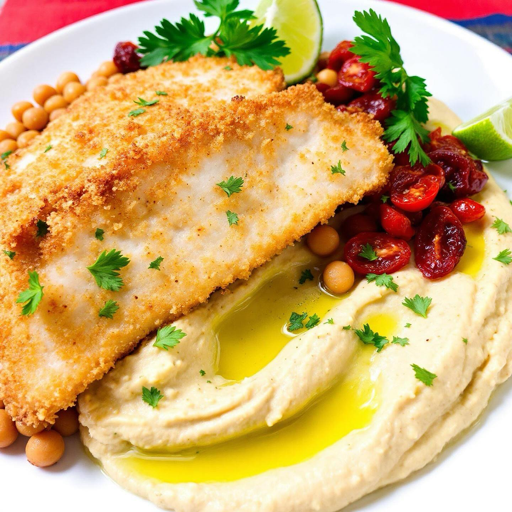

# ### Baccalà fritto su ceci croccanti con hummus di ceci, lime e pomodori secchi 

### Baccalà fritto su ceci croccanti con hummus di ceci, lime e pomodori secchi #### Ingredienti (4 persone) - **Baccalà fritto:** - 600 g di baccalà ammollato - 150 g di farina - 2 uova - 100 g di pangrattato - Olio per friggere - Sale e pepe q.b. - **Ceci croccanti:** - 400 g di ceci precotti - 2 cucchiai di olio d’oliva - Paprika, cumino, sale e pepe q.b. - **Hummus:** - 400 g di ceci precotti - 4-6 pomodori secchi - Succo e scorza di 1 lime - 2 cucchiai di tahina (facoltativa) - 3-4 cucchiai di olio d’oliva - Sale e acqua q.b. #### Preparazione 1. **Ceci croccanti:** Mescola i ceci con olio, paprika, cumino, sale e pepe. Cuoci in forno a 200 °C per 25-35 minuti fino a doratura. 2. **Hummus:** Frulla i ceci, i pomodori secchi, il lime, la tahina, l’olio e il sale fino a ottenere una crema liscia. Aggiusta con acqua se necessario. 3. **Baccalà fritto:** Passa i tranci di baccalà nella farina, nelle uova e nel pangrattato. Friggi in olio caldo fino a doratura. 4. **Impiattamento:** Disponi hummus, ceci croccanti e baccalà fritto su un piatto. Decora con un filo d’olio e prezzemolo. #leguminando

---

*Ricetta da @leguminando*
