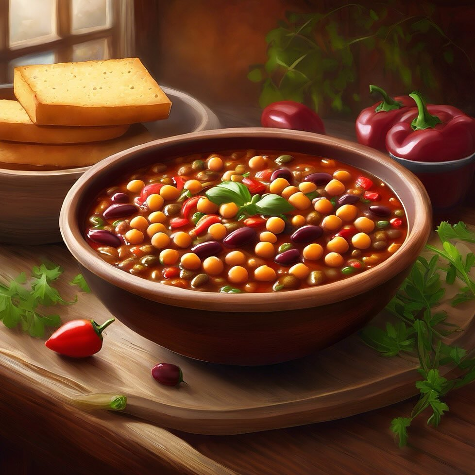

# Chili di Ceci e Lenticchie **Ingredienti**: - 200 g di ceci - 200 g di lenticchi

Chili di Ceci e Lenticchie **Ingredienti**: - 200 g di ceci - 200 g di lenticchie - 1 peperone - 1 cipolla - 400 g di pomodori pelati - Spezie (cumino, paprika, peperoncino) - Sale q.b. **Preparazione**: 1. Soffriggi la cipolla e il peperone tritati in olio d’oliva. 2. Aggiungi i ceci, le lenticchie, i pomodori e le spezie. 3. Cuoci a fuoco lento per 30-40 minuti, mescolando di tanto in tanto. 4. Aggiusta di sale e servi caldo. Chili di Ceci e Lenticchie - **Varianti**: Aggiungi fagioli neri o rossi per una maggiore varietà di legumi. - **Consiglio**: Servi con un po’ di avocado fresco o panna acida per bilanciare i sapori piccanti.

---

*Ricetta da @leguminando*
