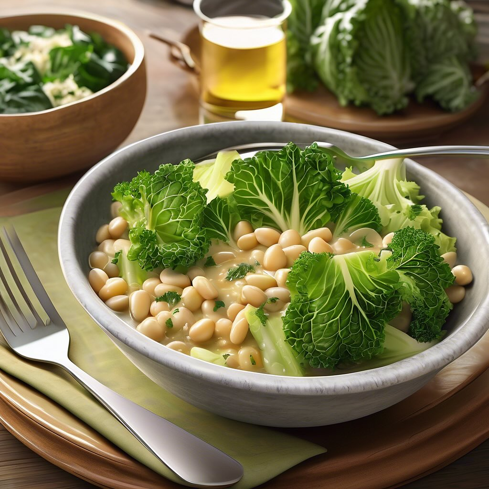

# Ecco una deliziosa ricetta per un contorno nutriente e saporito a base di cavolo

Ecco una deliziosa ricetta per un contorno nutriente e saporito a base di cavolo verza, scarola e fagioli. ### Ingredienti - 300 g di cavolo verza - 300 g di scarola - 400 g di fagioli (preferibilmente cannellini o borlotti, già lessati) - 2 spicchi d’aglio - 4 cucchiai di olio d’oliva extravergine - Sale e pepe q.b. - Peperoncino (facoltativo) - Succo di limone (facoltativo) ### Procedimento 1. **Preparazione delle verdure**: Lavare bene il cavolo verza e la scarola. Tagliare il cavolo verza a strisce e la scarola a pezzi grossi. 2. **Soffritto**: In una grande padella, scaldare l’olio d’oliva a fuoco medio. Aggiungere gli spicchi d’aglio schiacciati e, se si desidera, il peperoncino. Far soffriggere fino a quando l’aglio diventa dorato, poi rimuoverlo. 3. **Cottura delle verdure**: Aggiungere il cavolo verza nella padella e farlo cuocere per circa 5-7 minuti, mescolando di tanto in tanto, finché non inizia ad appassire. Aggiungere poi la scarola e continuare a cuocere per altri 5 minuti. 4. **Aggiunta dei fagioli**: Unire i fagioli lessati alla padella, mescolare bene e cuocere per ulteriori 5 minuti. Aggiustare di sale e pepe a piacere. 5. **Servizio**: Se desiderato, spruzzare il tutto con un po’ di succo di limone prima di servire. Questo piatto può essere gustato sia caldo che a temperatura ambiente.

---

*Ricetta da @leguminando*
