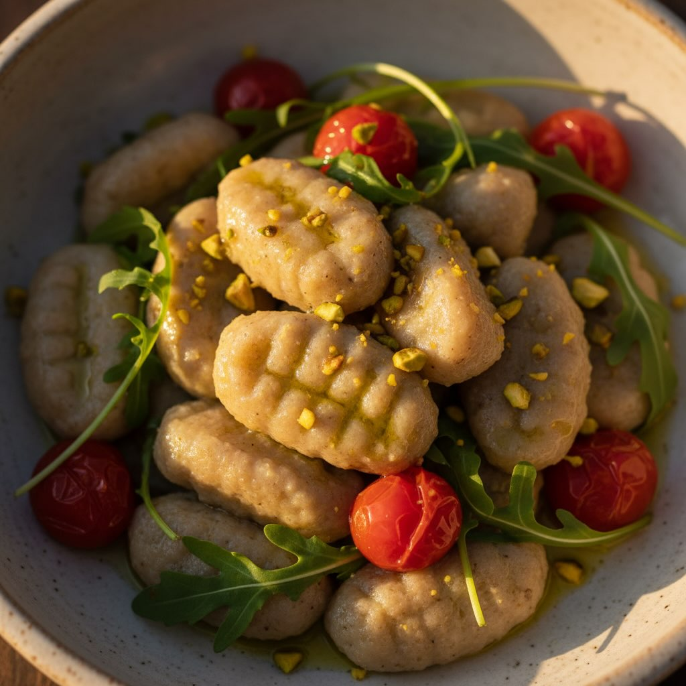

# Gnocchi di Avena in Primavera #leguminando **Ingredienti per 2 persone** - 250 g

Gnocchi di Avena in Primavera #leguminando **Ingredienti per 2 persone** - 250 g di farina di avena - 100 g di farina di lenticchie rosse - 1 uovo grande - 50 ml di acqua tiepida (aggiungi di più se necessario) - Sale fino, poco più di ½ cucchiaino, a piacere - 6-8 pomodorini confit - 2 carciofi puliti e tagliati a rondelle - Una manciata di rucola fresca - 1 cucchiaio di pistacchi sgusciati, tritati grossolanamente - Pecorino stagionato grattugiato, quanto basta - Olio extravergine d’oliva, per soffriggere **Procedimento** 1. **Impasto di lenticchie** - Mescola 100 g di farina di lenticchie con 50 ml di acqua tiepida in una ciotola, fino a ottenere una pastella liscia e omogenea. 2. **Preparazione dell’impasto per gli gnocchi** - Unisci in una ciotola capiente la farina di avena, l’impasto di lenticchie, l’uovo e il sale. Aggiungi gradualmente 20-30 ml di acqua tiepida, mescolando fino a ottenere un impasto morbido ma non appiccicoso, che si stacca facilmente dalle dita. 3. **Formatura** - Infarina le mani e preleva porzioni di impasto. Rotola con il palmo dei piccoli cilindri lunghi circa 1 cm, poi tagliali a pezzetti di 2 cm e arrotolali delicatamente per formare delle piccole pillole. 4. **Soffritto di carciofi** - Scalda 1 cucchiaio d’olio in una padella antiaderente. Aggiungi le rondelle di carciofo e cuoci a fuoco medio per 5-6 minuti, fino a doratura e tenerezza. 5. **Cottura degli gnocchi** - Porta a ebollizione una pentola d’acqua salata. Cuoci gli gnocchi fino a quando non salgono in superficie (3-4 minuti). Scolali con una schiumarola. 6. **Composizione** - Salta gli gnocchi in padella con i carciofi per un paio di minuti. Trasferisci nei piatti e guarnisci con pomodorini confit tagliati a metà, foglie di rucola, pistacchi tritati e una generosa spolverata di pecorino. 7. **Servire** - Servi caldo, con un filo d’olio a crudo e, se desiderato, una spolverata extra di pecorino. Ricca di proteine (23 g) e fibre (10 g), questa preparazione sostiene sazietà, salute cardiovascolare e apporta calcio e potassio.

---

*Ricetta da @leguminando*
