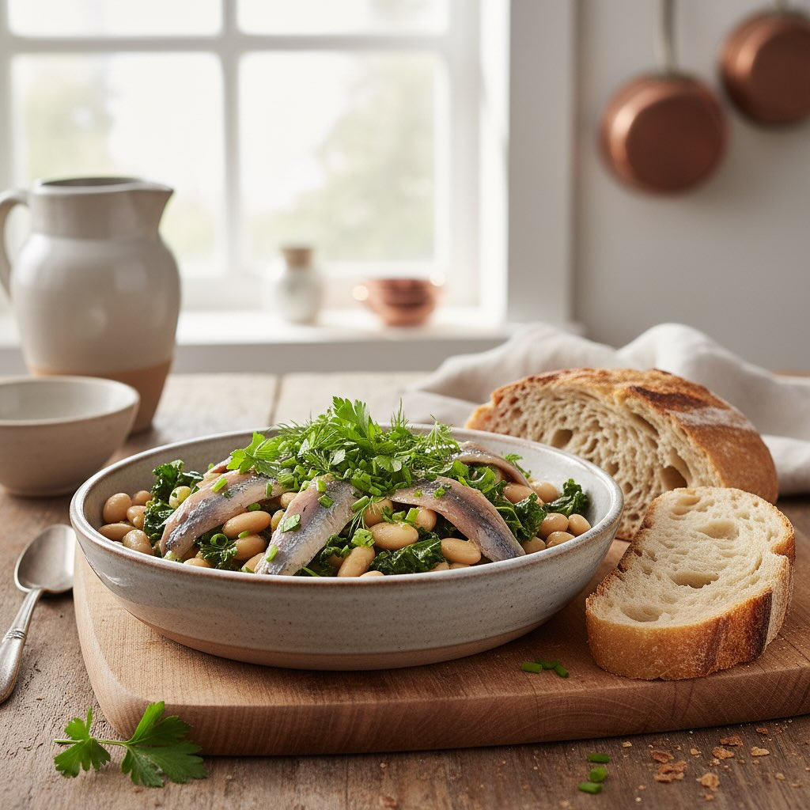

# #### Ingredienti: - 200 g di acciughe del Cantabrico - 300 g di fagioli dall’occ

#### Ingredienti: - 200 g di acciughe del Cantabrico - 300 g di fagioli dall’occhio (già cotti) - 200 g di cavolo nero - 1 cipolla - 1 spicchio d’aglio - 1 carota - 1 gambo di sedano - Olio extravergine d’oliva q.b. - Sale e pepe q.b. - Peperoncino (facoltativo) #### Procedimento: 1. **Preparazione delle Verdure**: - Inizia pulendo e tagliando finemente la cipolla, l’aglio, la carota e il sedano. - Lava il cavolo nero e taglialo a strisce. 2. **Soffritto**: - In una pentola capiente, scalda un filo d’olio extravergine d’oliva a fuoco medio. - Aggiungi la cipolla, l’aglio, la carota e il sedano. Fai soffriggere fino a quando le verdure non sono tenere e la cipolla diventa trasparente. 3. **Cottura del Cavolo**: - Aggiungi il cavolo nero nella pentola e mescola bene. Cuoci per circa 5-7 minuti, fino a quando il cavolo inizia ad appassire. 4. **Aggiunta dei Fagioli**: - Unisci i fagioli dall’occhio già cotti e mescola per amalgamare il tutto. Se necessario, aggiungi un po’ d’acqua per evitare che si attacchi. 5. **Incorporare le Acciughe**: - Aggiungi le acciughe del Cantabrico, spezzettandole con una forchetta. Mescola delicatamente e lascia cuocere per altri 5 minuti, fino a quando le acciughe si sciolgono e insaporiscono il piatto. 6. **Condimento Finale**: - Aggiusta di sale e pepe a piacere. Se gradisci un tocco piccante, puoi aggiungere un pizzico di peperoncino. 7. **Servizio**: - Servi caldo, accompagnato da un filo d’olio extravergine d’oliva a crudo e, se ti piace, del pane croccante.

---

*Ricetta da @leguminando*
