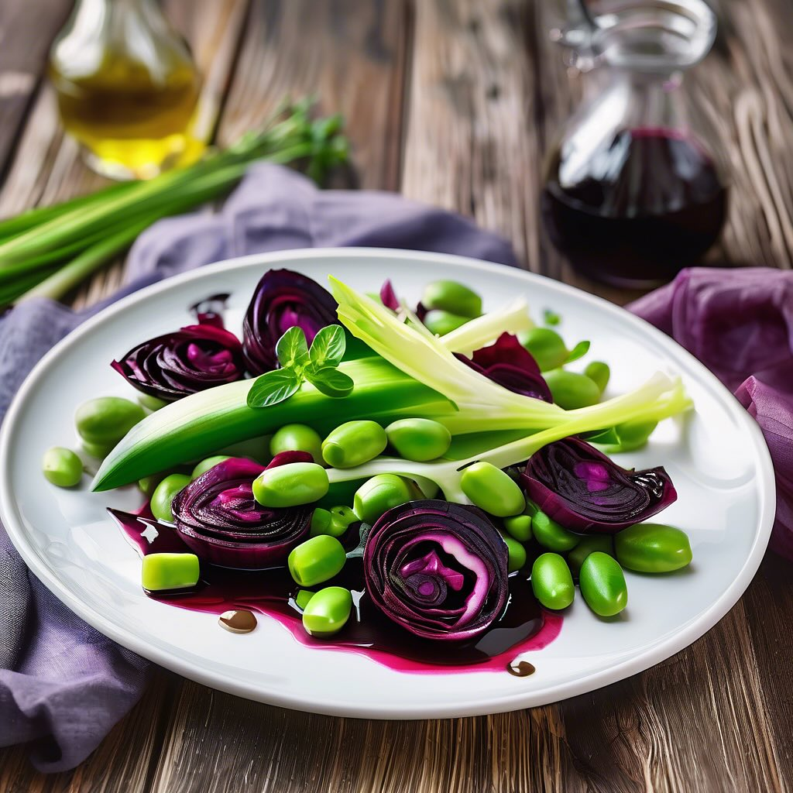

# ### Ingredienti - 200 g di asparagi freschi - 150 g di piselli freschi o surgela

### Ingredienti - 200 g di asparagi freschi - 150 g di piselli freschi o surgelati - 200 g di foglie di cavolo nero - 300 g di arselle (vongole) - 1 spicchio d’aglio - 2 cucchiai di olio extravergine d’oliva - 1/2 bicchiere di vino bianco secco - Sale e pepe q.b. - Prezzemolo fresco per guarnire - Limone (facoltativo) ### Istruzioni 1. **Preparare le arselle**: - Metti le arselle in acqua salata per circa 1 ora per farle spurgare. - Scolale e risciacquale sotto acqua corrente. 2. **Cuocere le foglie di cavolo nero**: - In una padella grande, scalda 1 cucchiaio di olio d’oliva e aggiungi lo spicchio d’aglio schiacciato. - Dopo un minuto, aggiungi le foglie di cavolo nero lavate e tagliate a strisce. Cuoci per 5-7 minuti fino a quando saranno tenere. Aggiungi sale e pepe a piacere. Togli dal fuoco e metti da parte. 3. **Cucinare le arselle**: - Nella stessa padella, aggiungi un altro cucchiaio di olio d’oliva e le arselle. Cuoci a fuoco medio, mescolando di tanto in tanto. - Sfuma con il vino bianco e copri con un coperchio. Cuoci fino a quando le arselle si aprono (circa 5-7 minuti). Scarta quelle che non si sono aperte. 4. **Cuocere gli asparagi e i piselli**: - Nella stessa padella, aggiungi gli asparagi tagliati a pezzetti e i piselli. Cuoci per 3-5 minuti fino a quando sono teneri ma ancora croccanti. Aggiusta di sale e pepe. 5. **Assemblare il piatto**: - Su un piatto di portata, disponi le foglie di cavolo nero come base. Aggiungi gli asparagi e i piselli sopra. - Distribuisci le arselle in modo uniforme sopra le verdure. 6. **Servire**: - Guarnisci con prezzemolo fresco tritato e, se desiderato, una spruzzata di limone. - Servi caldo o a temperatura ambiente.

---

*Ricetta da @leguminando*
