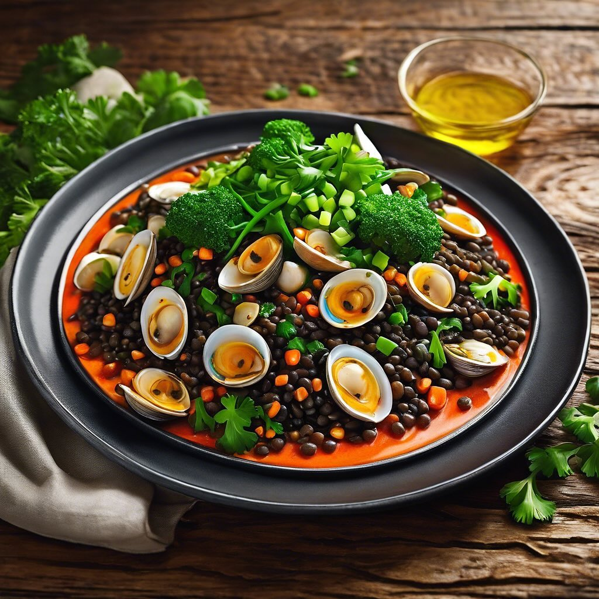

# ### Ingredienti - 200 g di lenticchie rosse - 100 g di lenticchie nere - 300 g d

### Ingredienti - 200 g di lenticchie rosse - 100 g di lenticchie nere - 300 g di cime di rapa - 500 g di vongole - 2 spicchi d’aglio - 1 peperoncino (facoltativo) - 4 cucchiai di olio extravergine d’oliva - Sale q.b. - Pepe nero q.b. - Prezzemolo fresco tritato per guarnire - 300 g di pasta (preferibilmente spaghetti o linguine) ### Procedimento 1. **Preparazione delle lenticchie**: Sciacqua le lenticchie rosse e nere sotto acqua corrente. Cuocile in acqua bollente salata per circa 15-20 minuti, fino a quando saranno tenere. Scolale e mettile da parte. 2. **Cottura delle vongole**: In una padella grande, scalda 2 cucchiai d’olio d’oliva e aggiungi gli spicchi d’aglio schiacciati e il peperoncino. Quando l’aglio inizia a dorarsi, aggiungi le vongole precedentemente pulite. Copri e cuoci per circa 5-7 minuti, finché le vongole si aprono. Scarta quelle che rimangono chiuse. 3. **Cuocere le cime di rapa**: In un’altra pentola, porta ad ebollizione dell’acqua salata e sbollenta le cime di rapa per 3-4 minuti. Scolale e raffreddale in acqua fredda per mantenere il colore. Sminuzzale e mettile da parte. 4. **Cottura della pasta**: Cuoci la pasta al dente in acqua salata. Scola e conserva un po’ di acqua di cottura. 5. **Unire gli ingredienti**: Nella padella con le vongole, aggiungi le lenticchie cotte e le cime di rapa. Mescola bene e aggiungi la pasta. Se necessario, aggiungi un po’ di acqua di cottura per amalgamare il tutto. 6. **Finitura**: Aggiusta di sale e pepe, e aggiungi un filo d’olio d’oliva. Mescola delicatamente per far insaporire. 7. **Servire**: Impiatta e guarnisci con prezzemolo fresco tritato. Servi caldo.

---

*Ricetta da @leguminando*
