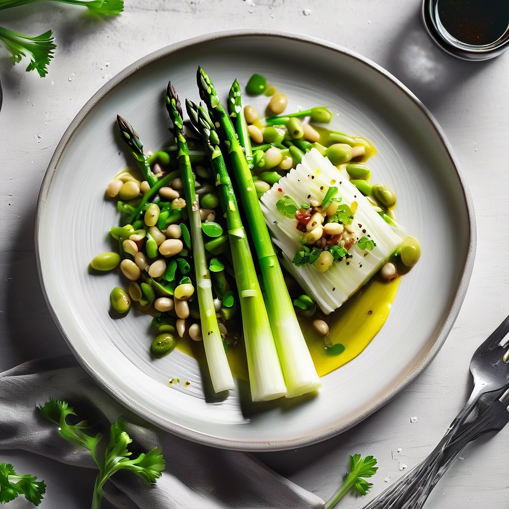

# ### Ingredienti: - 2 porri - 200 g di asparagi - 400 g di fagioli (cotti, meglio

### Ingredienti: - 2 porri - 200 g di asparagi - 400 g di fagioli (cotti, meglio se bianchi o cannellini) - 2 cucchiai di olio d’oliva - Sale e pepe q.b. - Succo di limone (facoltativo) - Prezzemolo fresco per guarnire (facoltativo) ### Procedimento: 1. **Preparazione delle verdure**: - Pulisci i porri, rimuovendo la parte verde e la radice, e tagliali a rondelle. - Lava gli asparagi e rimuovi la parte legnosa del gambo, quindi tagliali a pezzetti. 2. **Cottura**: - In una padella grande, scalda l’olio d’oliva a fuoco medio. - Aggiungi i porri e cuocili per 5 minuti, finché non diventano morbidi. - Aggiungi gli asparagi e continua a cuocere per altri 5 minuti, mescolando di tanto in tanto. 3. **Aggiunta dei fagioli**: - Aggiungi i fagioli già cotti nella padella e mescola bene. - Cuoci per altri 3-4 minuti, fino a quando i fagioli si riscaldano. - Aggiusta di sale e pepe e, se vuoi, aggiungi un po’ di succo di limone per freschezza. 4. **Servizio**: - Servi caldo, guarnito con prezzemolo fresco tritato, se desiderato.

---

*Ricetta da @leguminando*
