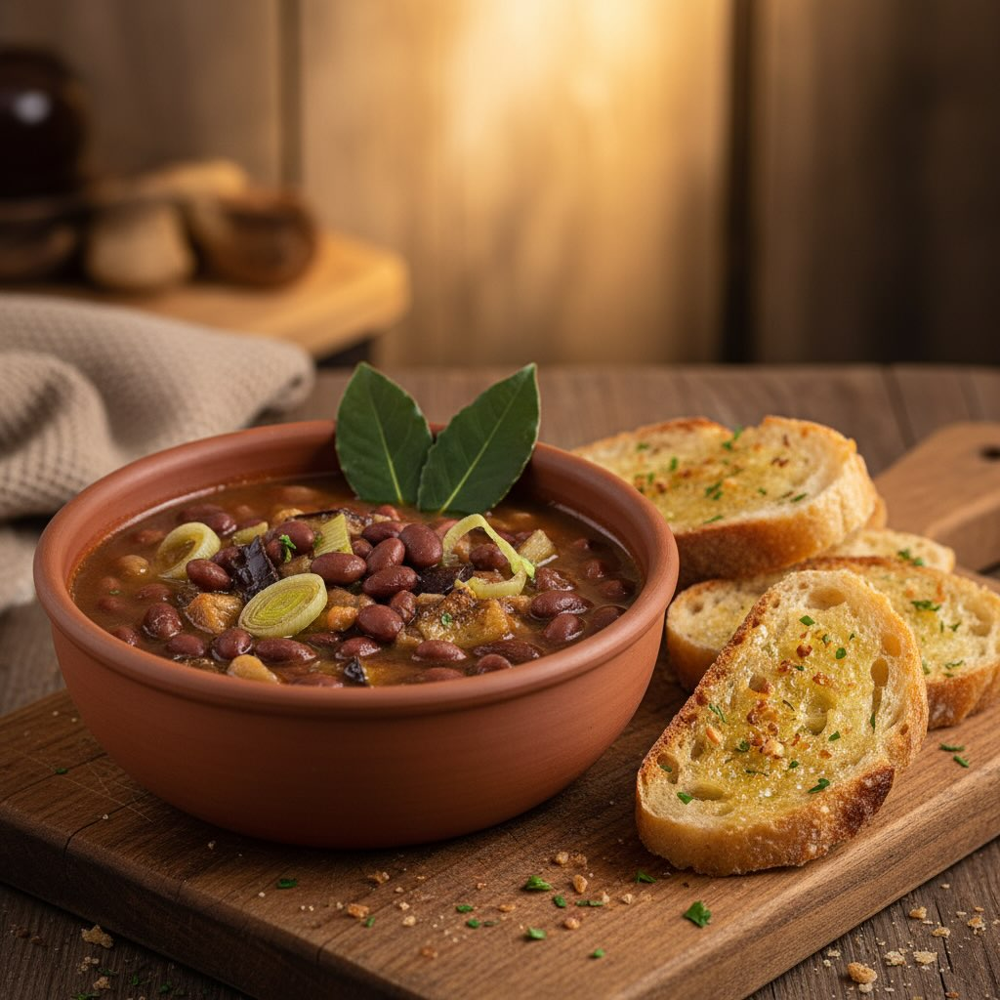

# ### Ingredienti - 300 g di roveja secca - 1 porro grande - 1 spicchio d’aglio - 

### Ingredienti - 300 g di roveja secca - 1 porro grande - 1 spicchio d’aglio - 6 foglie di alloro - 200 g di melanzane - Olio extravergine di oliva - Sale q.b. - Pepe q.b. - 4 fette di pane tostato con aglio ## Preparazione 1. **Preparazione della Roveja:** - Sciacqua la roveja sotto acqua corrente. - Mettila in ammollo in acqua fredda per almeno 8 ore o durante la notte. 2. **Cottura della Roveja:** - Scola e risciacqua la roveja ammollata. - In una pentola capiente, aggiungi la roveja, le foglie di alloro e copri con acqua fredda. - Porta a ebollizione e cuoci a fuoco lento per circa 1 ora o fino a quando la roveja è tenera. Aggiungi sale verso la fine della cottura. 3. **Preparazione delle Verdure:** - Lava e taglia il porro a rondelle sottili. - Taglia le melanzane a cubetti. - In una padella, scalda un filo di olio extravergine di oliva. Aggiungi l’aglio schiacciato e fallo dorare leggermente. - Aggiungi il porro e le melanzane, e cuoci a fuoco medio fino a quando le verdure sono morbide. Condisci con sale e pepe. 4. **Unione degli Ingredienti:** - Aggiungi le verdure cotte alla pentola con la roveja. - Lascia cuocere insieme per altri 15 minuti, in modo che i sapori si amalgamino bene. Assaggia e aggiusta di sale e pepe. 5. **Servizio:** - Togli le foglie di alloro dalla zuppa. - Servi la zuppa calda accompagnata dalle fette di pane tostato con aglio.

---

*Ricetta da @leguminando*
