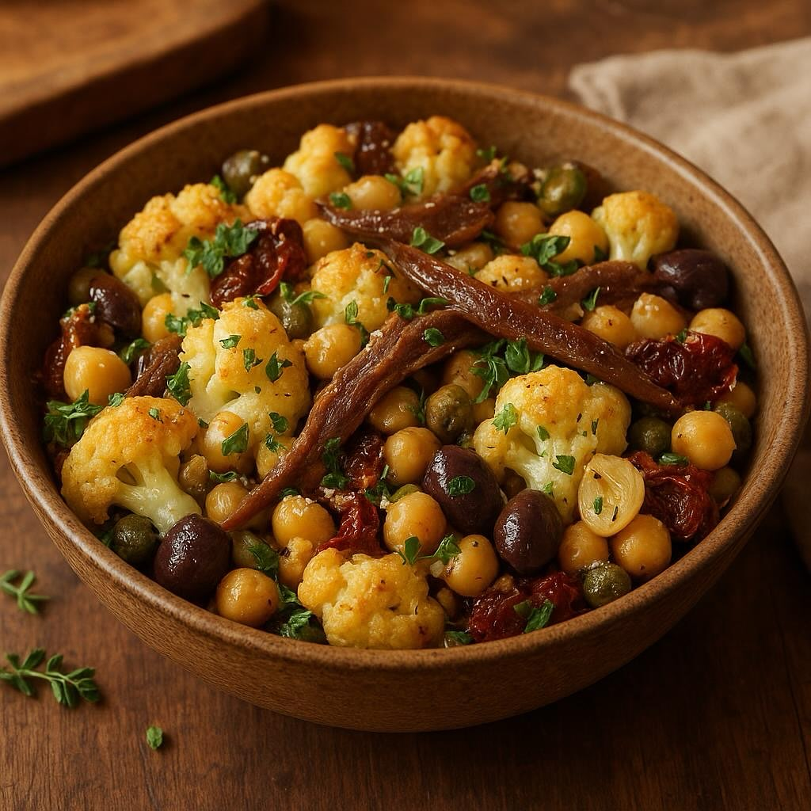

# #### Ingredienti: - 3 cavolfiori - 4-5 filetti di acciughe - 2-3 spicchi d’aglio

#### Ingredienti: - 3 cavolfiori - 4-5 filetti di acciughe - 2-3 spicchi d’aglio - 4-5 pomodorini secchi (o a piacere) - 2 cucchiai di capperi ben sciacquati - 100 g di olive taggiasche - 2 cucchiai di olio extravergine d’oliva (EVO) - 3 cucchiai di parmigiano grattugiato - 300 g di cicerchie (secche o già cotte) - Timo fresco e prezzemolo fresco q.b. - Sale e pepe q.b. #### Procedimento: 1. **Preparazione delle cicerchie:** - Se utilizzi cicerchie secche, mettile a bagno in acqua per almeno 12 ore. Dopo il periodo di ammollo, scolale e cuocile in acqua salata per circa 1-2 ore, fino a quando saranno tenere. Scolale e mettile da parte. - Se usi cicerchie già cotte, puoi saltare questo passaggio. 2. **Cottura del cavolfiore:** - Pulisci i cavolfiori, rimuovendo le foglie e il gambo, e dividili in cimette. - In una pentola, porta a ebollizione dell’acqua salata e lessa le cimette di cavolfiore per circa 5-7 minuti, finché saranno tenere ma ancora croccanti. Scolale e mettile da parte. 3. **Preparazione del condimento:** - In una padella capiente, scalda 2 cucchiai di olio EVO a fuoco medio. Aggiungi gli spicchi d’aglio schiacciati e i filetti di acciuga. Cuoci fino a quando le acciughe si sciolgono, mescolando di tanto in tanto. - Aggiungi i pomodorini secchi tagliati a pezzetti, i capperi e le olive taggiasche. Mescola bene e cuoci per qualche minuto per far amalgamare i sapori. 4. **Unione degli ingredienti:** - Aggiungi le cimette di cavolfiore e le cicerchie cotte al condimento nella padella. Mescola delicatamente per unire tutti gli ingredienti, assicurandoti che il cavolfiore e le cicerchie siano ben ricoperti dal condimento. - Regola di sale e pepe a piacere. Aggiungi il timo fresco e il prezzemolo tritato, mescolando ancora. 5. **Finitura e servizio:** - Spolvera con il parmigiano grattugiato e lascia insaporire per un paio di minuti a fuoco basso, finché il formaggio si scioglie leggermente. - Servi caldo, come secondo piatto o contorno.

---

*Ricetta da @leguminando*
