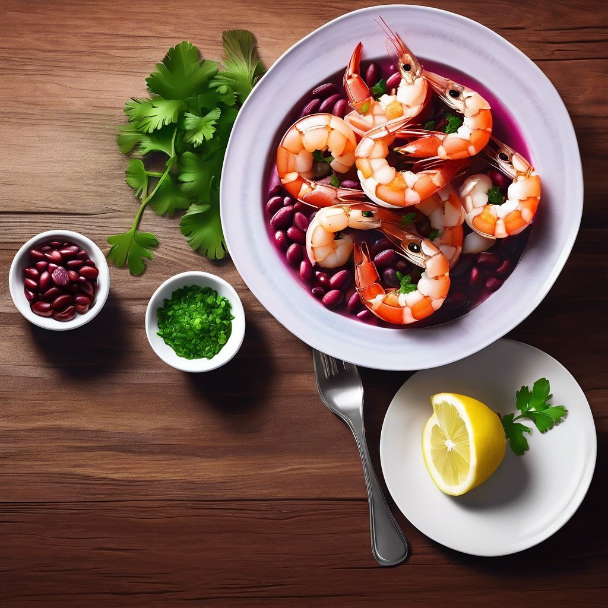

# ### Ingredienti - 500 g di gamberi o scampi, puliti - 200 g di ceci in scatola (

### Ingredienti - 500 g di gamberi o scampi, puliti - 200 g di ceci in scatola (o cotti) - 200 g di fagioli rossi in scatola (o cotti) - 1 cipolla piccola, tritata - 2 spicchi d’aglio, tritati - 1 peperoncino rosso fresco, affettato (opzionale) - 1 cucchiaino di paprika dolce - 1 cucchiaino di cumino in polvere - 1 cucchiaio di olio d’oliva - Succo di 1 limone - Sale e pepe q.b. - Prezzemolo fresco tritato per guarnire ### Procedimento 1. **Preparare i legumi**: Se utilizzi legumi in scatola, scolali e sciacquali bene sotto acqua corrente. Se utilizzi legumi secchi, cuocili secondo le istruzioni fino a quando sono teneri. 2. **Soffriggere le verdure**: In una padella grande, scalda l’olio d’oliva a fuoco medio. Aggiungi la cipolla e l’aglio, e soffriggi fino a quando la cipolla diventa trasparente. 3. **Aggiungere le spezie**: Unisci il peperoncino, la paprika e il cumino. Mescola bene per far sprigionare gli aromi. 4. **Cuocere i crostacei**: Aggiungi i gamberi o scampi nella padella e cuoci per circa 3-4 minuti, fino a quando diventano rosa e opachi. 5. **Incorporare i legumi**: Aggiungi i ceci e i fagioli rossi alla padella. Mescola delicatamente e cuoci per altri 2-3 minuti per riscaldare i legumi. 6. **Condire**: Aggiungi il succo di limone, sale e pepe a piacere. Mescola bene per amalgamare tutti gli ingredienti. 7. **Servire**: Trasferisci i crostacei speziati con legumi su un piatto da portata e guarnisci con prezzemolo fresco tritato. ### Suggerimenti - Puoi servire questo piatto con riso basmati o pane pita per un pasto completo. - Aggiungi altre verdure come spinaci o zucchine per arricchire ulteriormente il piatto.

---

*Ricetta da @leguminando*
