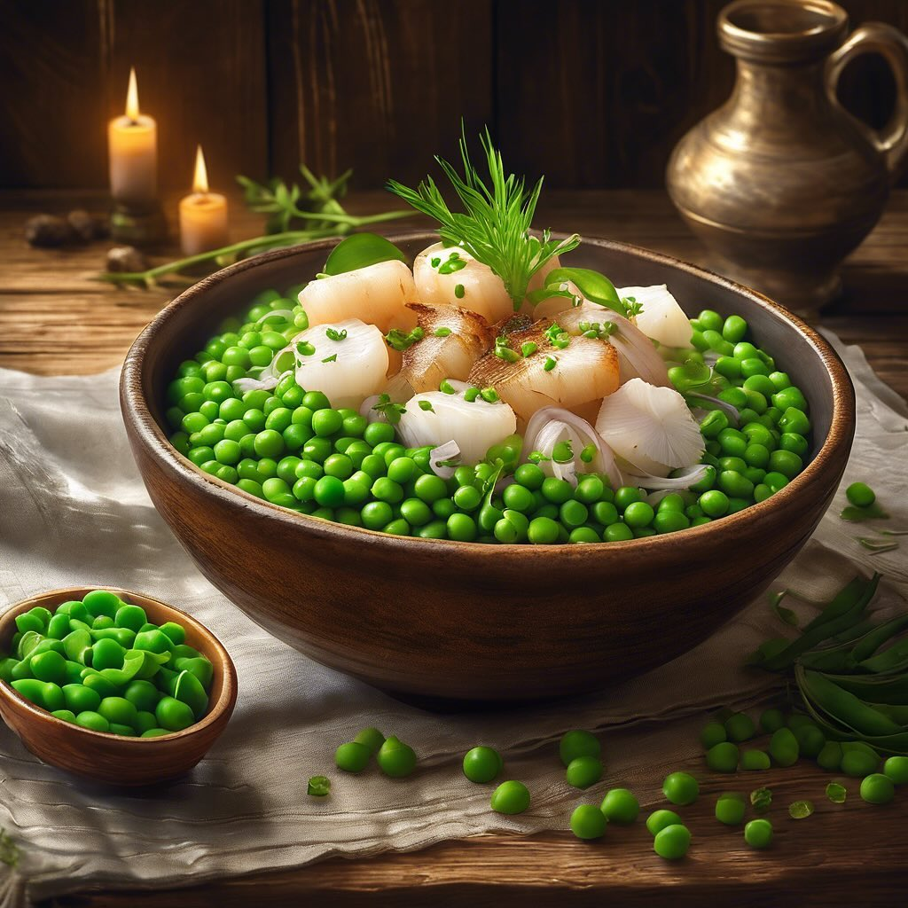

# ## Ingredienti: - 500 g di seppie pulite - 300 g di piselli freschi o surgelati 

## Ingredienti: - 500 g di seppie pulite - 300 g di piselli freschi o surgelati - 2 cipolle - 2-3 spicchi d’aglio - 1 bicchiere di vino bianco secco - Olio extravergine d’oliva - Sale e pepe q.b. - Prezzemolo fresco per guarnire ### Procedimento: 1. **Preparazione delle seppie**: Se non sono già pulite, rimuovi la pelle e le interiora delle seppie. Tagliale a strisce o a pezzi. 2. **Soffritto**: In una padella capiente, scalda un filo d’olio d’oliva. Aggiungi le cipolle tritate finemente e gli spicchi d’aglio schiacciati. Fai rosolare a fuoco medio fino a quando le cipolle diventano traslucide. 3. **Cottura delle seppie**: Aggiungi le seppie nella padella e cuocile per circa 5-7 minuti, mescolando di tanto in tanto, fino a quando si colorano leggermente. 4. **Aggiunta del vino**: Versa il vino bianco e lascia evaporare per un paio di minuti, in modo che l’alcol si riduca. 5. **Cottura dei piselli**: Aggiungi i piselli e un po’ di sale e pepe. Mescola bene e copri la padella. Lascia cuocere a fuoco lento per circa 15-20 minuti, fino a quando le seppie sono tenere e i piselli sono cotti. 6. **Regola di sale e pepe**: Assaggia e aggiusta di sale e pepe secondo il tuo gusto. 7. **Servizio**: Servi il piatto caldo, guarnito con prezzemolo fresco tritato e un filo d’olio d’oliva.

---

*Ricetta da @leguminando*
