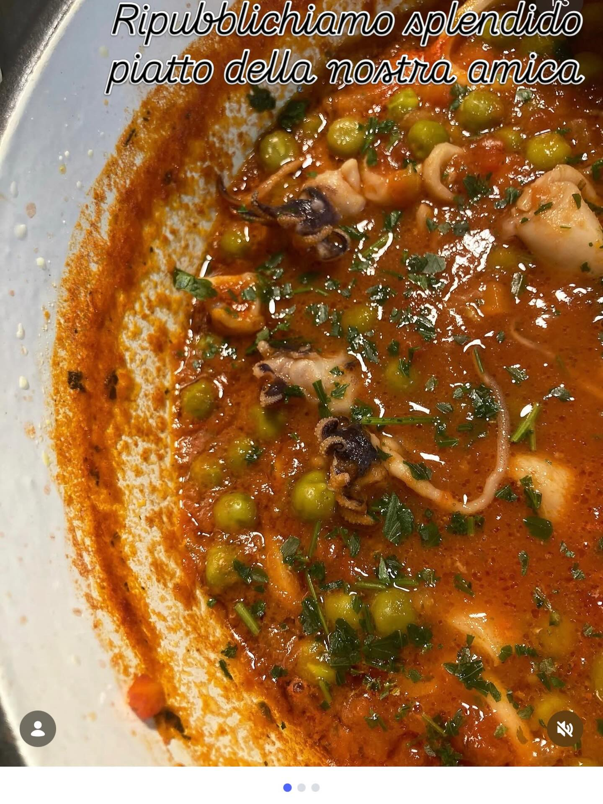

# ### Ingredienti - **Ceci lessati**: 400 g - **Farina di ceci**: 50 g - **Fecola 

### Ingredienti - **Ceci lessati**: 400 g - **Farina di ceci**: 50 g - **Fecola di patate**: 20 g - **Olio extravergine di oliva**: 2 cucchiai - **Sale e pepe**: q.b. - **Spezie**: cumino, peperoncino, curcuma (oppure erbe aromatiche come prezzemolo, rosmarino, timo) - **Parmigiano o pecorino grattugiato**: 2 cucchiai (opzionale) ## Per la panatura - **Farina**: 50 g - **Acqua**: q.b. per creare una pastella densa - **Sale**: un pizzico - **Pangrattato**: q.b. Preparazione 1. **Frullare i ceci**: Metti i ceci lessati nel frullatore con la farina di ceci, fecola di patate, olio d&#039;oli’a, sale, pepe e le spezie o erbe aromatiche scelte. Frulla fino a ottenere un impasto omogeneo. 2. **Aggiungere il formaggio**: Se desideri, incorpora il parmigiano o pecorino grattugiato per un gusto più ricco. 3. **Formare le cotolette**: Con le mani, forma delle cotolette dall&#039;imp’sto, pressandole bene per evitare che si rompano. 4. **Preparare la pastella**: Mescola la farina con acqua e un pizzico di sale fino a ottenere una pastella liscia e densa. 5. **Panare le cotolette**: Immergi ogni cotoletta nella pastella e poi passala nel pangrattato, assicurandoti che sia ben ricoperta. 6. **Cuocere in padella**: Scalda un filo d&#039;oli’ d’oliva in una padella antiaderente. Cuoci le cotolette su entrambi i lati fino a doratura, circa 3-4 minuti per lato. 7. **Servire**: Una volta cotte, asciugale su carta assorbente e servile calde con il contorno che preferisci.

---

*Ricetta da @leguminando*
