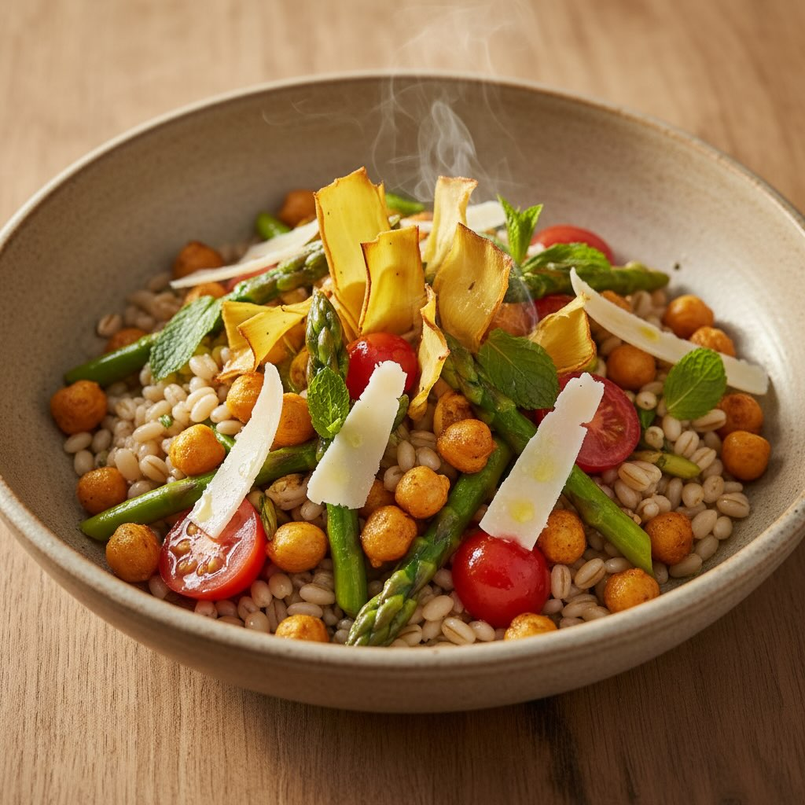

# ### Ingredienti - **Farro Perlato:** 150g - **Ceci Precotti:** 200g (o 100g secc

### Ingredienti - **Farro Perlato:** 150g - **Ceci Precotti:** 200g (o 100g secchi) - **Carciofi:** 2 cuori - **Asparagi:** 1 mazzetto - **Pomodorini Datterini:** 100g - **Cipollotto Fresco:** 1 - **Pecorino Stagionato a Scaglie:** 50g - **Menta Fresca** - **Olio EVO:** per friggere e condire - **Condimenti:** Sale, pepe, succo di limone ## Procedimento 1. **Cuocere il Farro:** Cuoci in acqua salata per 15 minuti, scola e metti da parte. 2. **Preparare i Ceci Croccanti:** Cuoci metà dei ceci in padella con olio, sale e peperoncino per 10 minuti a fuoco alto finché non diventano croccanti. 3. **Preparare le Chips di Carciofo:** Affetta i cuori di carciofo sottili con una mandolina e friggili in olio bollente per 2-3 minuti finché non sono dorati e croccanti. Scola su carta assorbente e sala subito. 4. **Cuocere le Verdure Tiepidamente:** Salta in padella con un filo d’olio gli asparagi tagliati a tocchetti e i pomodorini dimezzati per 5 minuti, devono risultare tiepidi, non completamente cotti. 5. **Assemblaggio (Caldo):** - **Base:** Farro caldo scolato - **Aggiungi:** Ceci croccanti e ceci morbidi - **Verdure:** Aggiungi le verdure saltate tiepide - **Guarnizioni:** Cipollotto fresco a rondelle, chips di carciofo in verticale, pecorino e menta.

---

*Ricetta da @leguminando*
