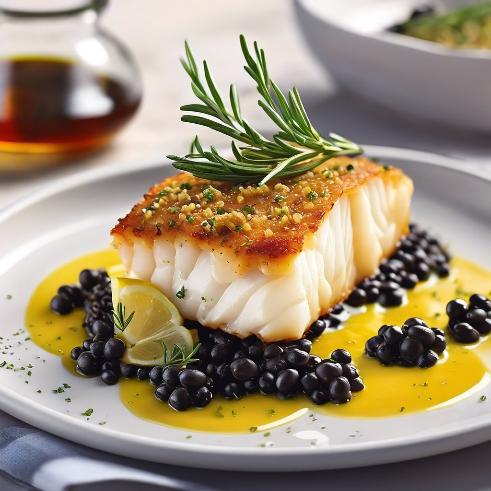

# ### Ingredienti - Parte 1 #### Per i cuori di baccalà: - 4 filetti di baccalà (c

### Ingredienti - Parte 1 #### Per i cuori di baccalà: - 4 filetti di baccalà (circa 150 g ciascuno, già dissalati) - 100 g di pistacchi non salati, tritati - 50 g di Parmigiano Reggiano grattugiato - 2 cucchiai di olio d’oliva - Sale e pepe q.b. - Succo di limone #### Preparazione del baccalà: 1. **Preriscalda il forno:** Imposta il forno a 200°C in modo che sia caldo al momento di infornare il baccalà. 2. **Prepara la crosta:** In una ciotola, mescola i pistacchi tritati con il Parmigiano Reggiano grattugiato. Aggiungi un pizzico di sale e pepe. Questa miscela darà una crosta croccante e saporita. 3. **Condire il baccalà:** Posiziona i filetti di baccalà su una teglia foderata con carta da forno. Assicurati che i filetti siano ben distanziati e asciutti. Spennella generosamente la superficie di ciascun filetto con olio d’oliva e spruzza con succo di limone. Questo non solo condirà il pesce, ma aiuterà anche la crosta ad aderire meglio. 4. **Aggiungere la crosta:** Prendi la miscela di pistacchi e Parmigiano e distribuiscila uniformemente sopra ciascun filetto di baccalà. Premi leggermente la crosta affinché aderisca bene al pesce. 5. **Cuocere in forno:** Inforna i filetti di baccalà per circa 15-20 minuti, o fino a quando il pesce è cotto (dovrebbe sfaldarsi facilmente con una forchetta) e la crosta è dorata e croccante. Se necessario, puoi accendere il grill negli ultimi minuti per ottenere una crosta ancora più dorata.

---

*Ricetta da @leguminando*
