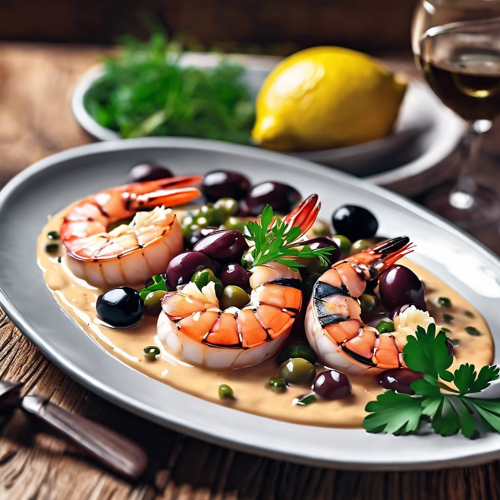

# ### Ingredienti - **Per la crema**: - 200 g di fagioli rossi (già cotti) - 100 g

### Ingredienti - **Per la crema**: - 200 g di fagioli rossi (già cotti) - 100 g di olive taggiasche denocciolate - 20 g di capperi dissalati - 2 cucchiai di olio extravergine d’oliva - Succo di mezzo limone - Sale e pepe q.b. - **Per i gamberoni**: - 8-10 gamberoni freschi - Olio extravergine d’oliva - Aglio (facoltativo) - Prezzemolo fresco tritato per guarnire ### Procedimento 1. **Preparare la crema**: - In un frullatore, unisci i fagioli rossi, le olive taggiasche, i capperi, l’olio d’oliva e il succo di limone. Frulla fino a ottenere una crema liscia. Se necessario, aggiungi un po’ d’acqua per rendere la crema più fluida. - Aggiusta di sale e pepe secondo il tuo gusto. 2. **Cuocere i gamberoni**: - Preriscalda la brace o una griglia. - Pulire i gamberoni, rimuovendo il carapace e il filo intestinale. Puoi anche lasciarli interi, a seconda della tua preferenza. - Spennella i gamberoni con un po’ d’olio d’oliva e, se ti piace, aggiungi uno spicchio d’aglio schiacciato. - Cuocili sulla brace per circa 3-4 minuti per lato, fino a quando diventano rosa e ben cotti. 3. **Assemblare il piatto**: - In un piatto, stendi un generoso strato di crema di fagioli rossi, olive e capperi. - Adagia sopra i gamberoni grigliati. 4. **Guarnire e servire**: - Spolvera con prezzemolo fresco tritato e, se desideri, aggiungi un filo d’olio d’oliva a crudo. - Servi il piatto caldo o tiepido.

---

*Ricetta da @leguminando*
