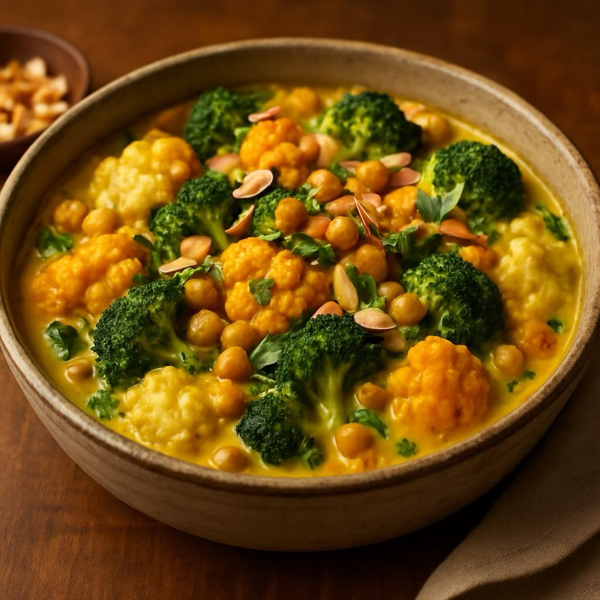

# Ingredienti – 200 g cavolfiore bianco (a cimette) – 200 g cavolfiore arancione (

Ingredienti – 200 g cavolfiore bianco (a cimette) – 200 g cavolfiore arancione (a cimette) – 200 g broccoli (solo le cimette, parte verde brillante) – 240 g ceci lessati (in scatola oppure cotti in casa) – 30 g burro – 30 g farina 00 – 500 ml latte (o bevanda vegetale non dolcificata) – 1 cucchiaino raso di curcuma in polvere – 1 pizzico di pepe nero macinato fresco – 1 pizzico di noce moscata – Sale q.b. – Olio extravergine d’oliva q.b. – Prezzemolo fresco tritato (per guarnire) – Una manciata di mandorle a lamelle tostate (facoltative) Procedimento 1. Preparare i cavoli a) Porta a ebollizione una pentola d’acqua salata. b) Sbollenta separatamente le cimette di cavolfiore bianco, cavolfiore arancione e broccoli per 4–5 minuti, finché restano croccanti. c) Scolale e immergile subito in acqua fredda per bloccare la cottura e mantenere i colori vivi. 2. Besciamella alla curcuma a) In un pentolino sciogli il burro a fuoco medio. b) Aggiungi la farina tutta in una volta e mescola con una frusta, cuocendo il roux 1–2 minuti senza farlo scurire. c) Versa il latte a filo, continuando a mescolare per evitare grumi. d) Appena la salsa si addensa, incorpora la curcuma, un pizzico di noce moscata, sale e pepe. e) Lascia sobbollire 2–3 minuti, finché la besciamella risulta liscia e leggermente dorata. 3. Unire ceci e verdure a) In una ciotola capiente, mescola le cimette di cavolo (bianco, arancione e verde) con i ceci scolati e un filo d’olio. b) Versa sopra la besciamella alla curcuma e amalgama delicatamente, in modo che tutti gli ingredienti risultino avvolti dalla salsa. 4. Gratinare a) Trasferisci il composto in una pirofila leggermente unta. b) Se ti piace, spolvera con un cucchiaio di parmigiano grattugiato o lamelle di mandorla tostata. c) Inforna in forno già caldo a 180 °C per 15–18 minuti, o finché la superficie prende un leggero colore dorato.

---

*Ricetta da @leguminando*
