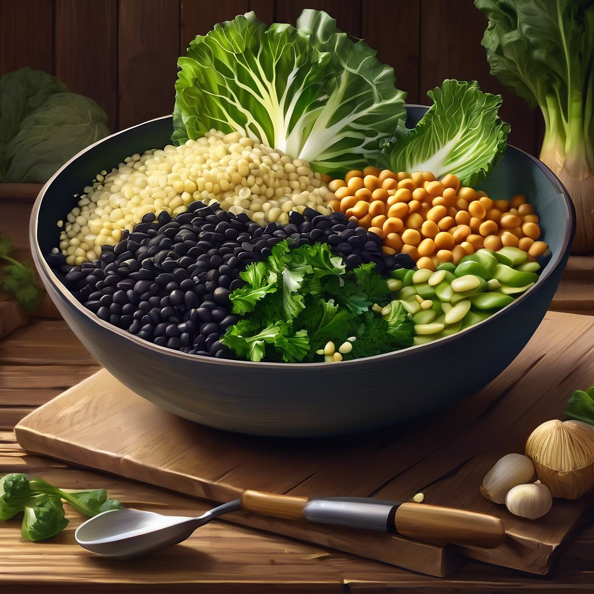

# ## Ingredienti #### Per i filetti di sarde: - 4 filetti di sarde fresche - Olio 

## Ingredienti #### Per i filetti di sarde: - 4 filetti di sarde fresche - Olio d’oliva - Succo di limone - Sale e pepe - Erbe aromatiche (come prezzemolo o origano) per guarnire #### Per l’hummus di ceci marroni: - 200 g di ceci marroni (cotti o in scatola) - 2 spicchi d’aglio - 2 cucchiai di tahini - Succo di 1 limone - 1/2 cucchiaino di paprika - 1/4 di cucchiaino di zafferano (precedentemente sciolto in un cucchiaio d’acqua calda) - Olio d’oliva q.b. - Sale q.b. - Acqua q.b. per ottenere la consistenza desiderata #### Per i peperoni rossi grigliati: - 2 peperoni rossi - Olio d’oliva - Sale e pepe ### Procedimento 1. **Preparare i peperoni**: - Lavare i peperoni, tagliarli a metà e rimuovere i semi. - Spennellarli con olio d’oliva, salare e pepare. - Grigliare i peperoni su una griglia calda per circa 6-8 minuti per lato, fino a quando sono teneri e leggermente carbonizzati. Metterli da parte. 2. **Preparare l’hummus di ceci marroni**: - In un frullatore, unire i ceci marroni, gli spicchi d’aglio, il tahini, il succo di limone, la paprika, lo zafferano sciolto e un pizzico di sale. - Frullare fino a ottenere una crema liscia, aggiungendo acqua e olio d’oliva a poco a poco per raggiungere la consistenza desiderata. Assaggiare e regolare di sale. 3. **Grigliare le sarde**: - Spennellare i filetti di sarde con olio d’oliva, condire con sale, pepe e un po’ di succo di limone. - Grigliare i filetti di sarde su una griglia calda per circa 3-4 minuti per lato, fino a quando sono cotti e leggermente dorati. 4. **Impiattare**: - Su un piatto, disporre un generoso cucchiaio di hummus di ceci marroni. - Aggiungere i filetti di sarde grigliate sopra l’hummus. - Completare con i peperoni rossi grigliati e guarnire con erbe aromatiche fresche. 5. **Servire**: - Servire il piatto caldo, accompagnato da fette di limone e un filo d’olio d’oliva a crudo.

---

*Ricetta da @leguminando*
