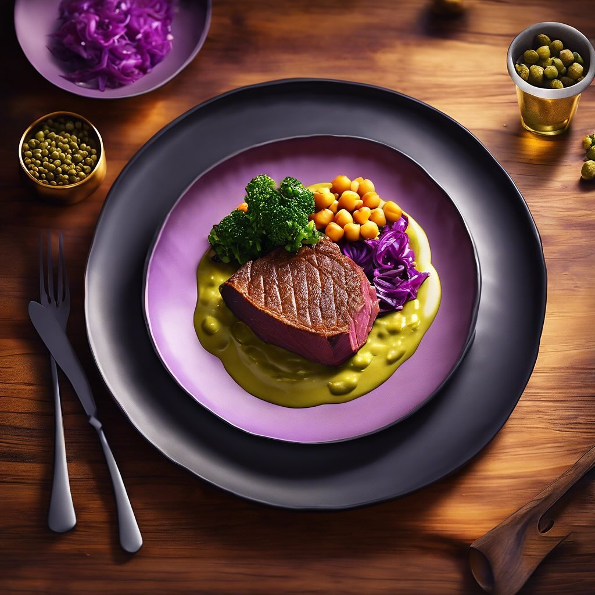

# ### Ingredienti #### Per il filetto di manzo: - 500 g di filetto di manzo &#064;

### Ingredienti #### Per il filetto di manzo: - 500 g di filetto di manzo &#064;slowfoodtoscana - 100 g di farina di lenticchie - 100 g di farina di ceci &#064;slowfoodlivorno - 2 cucchiai di capperi sott’aceto - 2 uova - Sale e pepe q.b. - Olio extravergine d’oliva q.b. &#064;slowfood_costaetruschiaps #### Per la crema di cavolo cappuccio: - 300 g di cavolo cappuccio - 200 ml di panna fresca - 1 spicchio d’aglio - 1 cucchiaio di olio extravergine d’oliva - Sale e pepe q.b. ### Procedimento #### 1. Preparazione del filetto di manzo: 1. **Marinare il filetto**: In una ciotola, condire il filetto di manzo con sale, pepe e un filo d’olio. Lasciare marinare per almeno 30 minuti. 2. **Preparare la crosta**: In un’altra ciotola, mescolare la farina di lenticchie e quella di ceci. In un piatto fondo, sbattere le uova. 3. **Impanare il filetto**: Passare il filetto prima nell’uovo sbattuto e poi nella miscela di farine, assicurandosi che sia ben ricoperto. 4. **Cottura**: Scaldare un po’ d’olio in una padella antiaderente e cuocere il filetto su fuoco medio-alto per circa 3-4 minuti per lato, fino a ottenere una crosta dorata. Aggiungere i capperi negli ultimi minuti di cottura per farli insaporire. #### 2. Preparazione della crema di cavolo cappuccio: 1. **Cuocere il cavolo**: In una pentola, scaldare l’olio e aggiungere lo spicchio d’aglio schiacciato. Aggiungere il cavolo cappuccio tagliato a strisce e cuocere per circa 10-15 minuti, fino a quando diventa tenero. 2. **Frullare**: Trasferire il cavolo cotto in un frullatore, aggiungere la panna fresca, sale e pepe. Frullare fino a ottenere una crema liscia. Se necessario, aggiungere un po’ d’acqua per raggiungere la consistenza desiderata. #### 3. Impiattamento: - Disporre un cucchiaio di crema di cavolo cappuccio sul piatto. - Adagiare sopra il filetto di manzo in crosta e guarnire con capperi. - Servire caldo e gustare!

---

*Ricetta da @leguminando*
