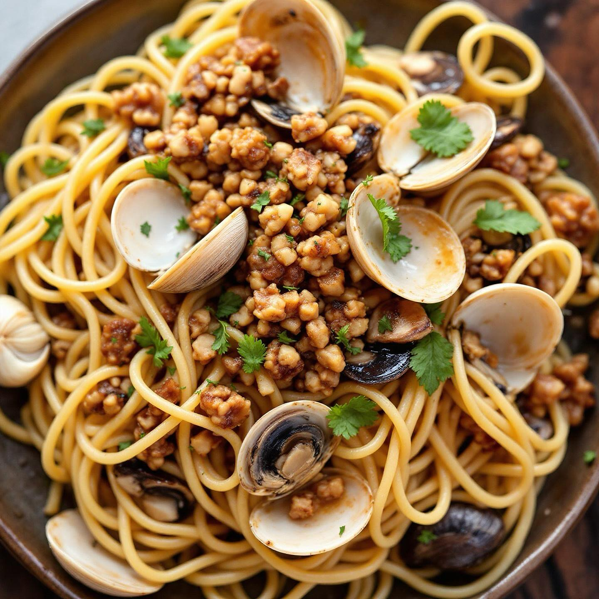

# ### Ingredienti per gli Strozzapreti: - 300 g di farina di lenticchie - 100 g di

### Ingredienti per gli Strozzapreti: - 300 g di farina di lenticchie - 100 g di noci tritate - 1 uovo (facoltativo, per legare) - Acqua q.b. - Sale q.b. ### Preparazione della Pasta: 1. In una ciotola, mescola la farina di lenticchie e le noci tritate. Se desideri un impasto più ricco, puoi aggiungere un uovo. 2. Aggiungi un pizzico di sale e comincia a mescolare. Aggiungi lentamente acqua fino a ottenere un impasto morbido ma non appiccicoso. 3. Lavora l’impasto su una superficie infarinata per circa 5-10 minuti, fino a quando diventa liscio. 4. Fai riposare l’impasto coperto da un canovaccio per circa 30 minuti. 5. Dividi l’impasto in porzioni e stendi ogni porzione in un cilindro. Taglia dei pezzi di circa 2-3 cm e arrotolali per formare gli strozzapreti. ### Ingredienti per il Condimento: - 200 g di porcini freschi (o surgelati) tagliati a cubetti - 300 g di vongole - 2 spicchi d’aglio - Olio extravergine d’oliva - Prezzemolo fresco tritato - Sale e pepe q.b. ### Preparazione del Condimento: 1. In una padella, scalda un paio di cucchiai di olio d’oliva e aggiungi gli spicchi d’aglio schiacciati. Fai rosolare fino a doratura. 2. Aggiungi i porcini a cubetti e cuoci per circa 5-7 minuti, fino a quando saranno teneri. Aggiungi sale e pepe a piacere. 3. In un’altra padella, cuoci le vongole con un po’ d’acqua e copri fino a quando si aprono. Scarta quelle che rimangono chiuse. 4. Unisci le vongole ai porcini e mescola bene. Aggiungi il prezzemolo tritato. ### Assemblaggio del Piatto: Cuoci gli strozzapreti in acqua salata per circa 3-4 minuti, scolali e uniscili al condimento di porcini e vongole. Mescola bene e servi caldo.

---

*Ricetta da @leguminando*
