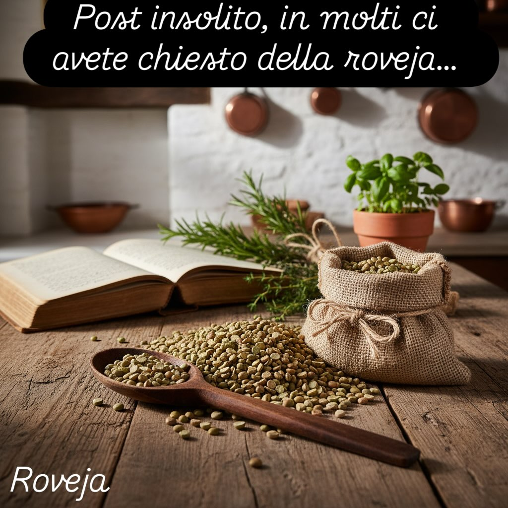

# Non siamo degli esperti di alimentazione e non vogliamo esserlo, in molti avete 

Non siamo degli esperti di alimentazione e non vogliamo esserlo, in molti avete chiesto info della roveja, vediamo di descrivere in sintesi. La roveja è un antico legume originario dell’Italia centrale, particolarmente diffuso nelle regioni montane come l’Umbria e le Marche. Ecco alcune caratteristiche e curiosità su questo legume: ### Caratteristiche - **Aspetto**: I semi della roveja sono simili a quelli dei piselli, ma di colore variabile dal verde al marrone scuro. - **Sapore**: Ha un gusto che ricorda vagamente quello delle fave, con una nota leggermente amarognola. - **Nutrizione**: Ricca di proteine, fibre, vitamine del gruppo B e minerali come ferro e potassio. ## Coltivazione e Storia - **Tradizione**: Coltivata fin dall&#039;’ntichità, la roveja era un alimento base per le popolazioni rurali. - **Coltivazione**: Predilige terreni montuosi e climi freschi. La coltivazione è spesso biologica e a basso impatto ambientale. Uso in Cucina - **Piatti tipici**: In cucina, la roveja è utilizzata per preparare zuppe, minestre e puree. Un piatto tradizionale è la &quot;far“cchiata”, una polenta ottenuta dalla farina di roveja. - **Preparazione**: Prima di essere cotta, la roveja deve essere messa in ammollo per alcune ore. Conservazione della Tradizione Negli ultimi anni, grazie a iniziative di agricoltori e consorzi locali, si è assistito a una riscoperta e valorizzazione di questo legume, spesso inserito in programmi di tutela dei prodotti tradizionali. Siamo stati esaustivi?

---

*Ricetta da @leguminando*
