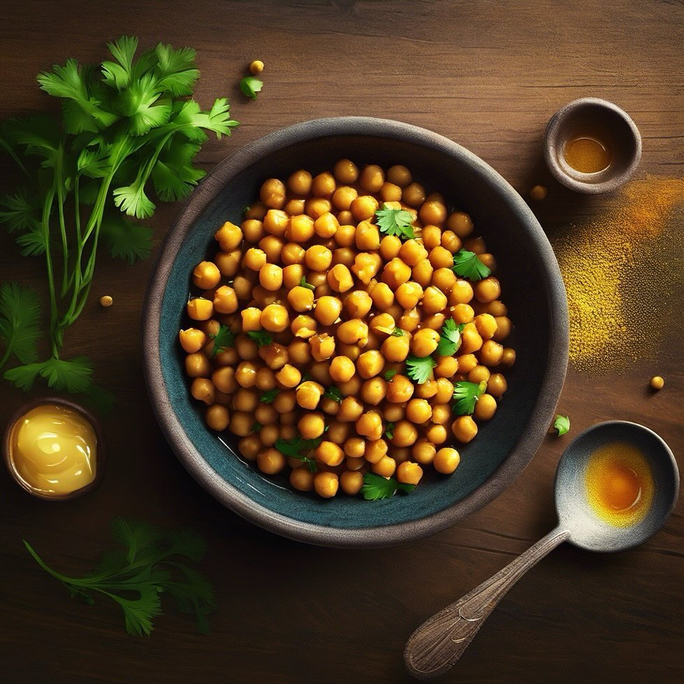

# Ricetta speciale della domenica!!! **Ceci alla curcuma con miele e spezie**

Ricetta speciale della domenica!!! **Ceci alla curcuma con miele e spezie**. ### Ingredienti: - 250 g di ceci decorticati (già cotti o in scatola) - 1 cucchiaio di curcuma in polvere - 2 cucchiai di miele - 1 spicchio d’aglio (tritato) - 1 cucchiaio di olio d’oliva - 1 cucchiaino di cumino in polvere - Sale e pepe q.b. - Prezzemolo fresco per guarnire (opzionale) - Succo di limone (opzionale) ### Procedimento: 1. **Preparazione dei ceci**: Se utilizzi ceci secchi, mettili a bagno per una notte e cuocili fino a che non diventano teneri. Se usi ceci in scatola, scolali e sciacquali bene. 2. **Soffritto**: In una padella ampia, scalda l’olio d’oliva a fuoco medio. Aggiungi l’aglio tritato e fallo soffriggere fino a doratura. 3. **Aggiunta di spezie**: Unisci la curcuma e il cumino, mescolando bene per far sprigionare i profumi. 4. **Cottura dei ceci**: Aggiungi i ceci nella padella e mescola bene per farli insaporire con le spezie. Cuoci per circa 5-7 minuti, mescolando di tanto in tanto. 5. **Miele**: Aggiungi il miele e mescola bene, lasciando caramellare leggermente i ceci per un paio di minuti. Aggiusta di sale e pepe. 6. **Servizio**: Servi i ceci caldi, guarniti con prezzemolo fresco e un filo di succo di limone, se desideri.

---

*Ricetta da @leguminando*
