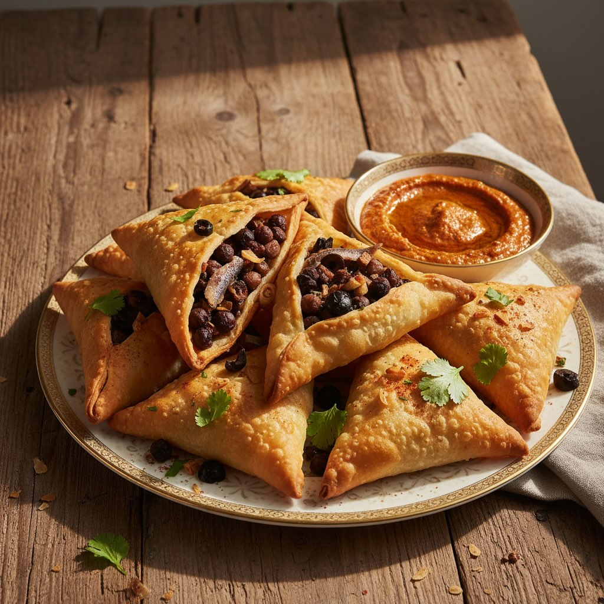

# Samosa ricetta 1 #### Per la pasta: - 250 g di farina - 2 cucchiai di olio veget

Samosa ricetta 1 #### Per la pasta: - 250 g di farina - 2 cucchiai di olio vegetale - 1 pizzico di sale - Acqua q.b. # Per il ripieno: - 200 g di ceci neri, cotti e macinati - 4-5 filetti di acciughe sott&#039;ol’o, tritati - 2 spicchi d&#039;ag’io, tritati - 1 cipolla media, tritata - 50 g di olive nere, denocciolate e tritate - 1 cucchiaio di olio d&#039;ol’va - 1 cucchiaino di cumino in polvere - 1 cucchiaino di coriandolo in polvere - 1/2 cucchiaino di peperoncino in polvere (opzionale) - Sale e pepe q.b. Procedura Preparazione della pasta: 1. **Mescola la farina e il sale** in una ciotola capiente. 2. **Aggiungi l&#039;olio vege’ale** e mescola bene fino a ottenere un composto bricioloso. 3. **Aggiungi acqua gradualmente**, impastando fino a ottenere una pasta liscia ed elastica. 4. **Copri la pasta con un panno umido** e lasciala riposare per circa 30 minuti. Preparazione del ripieno: 1. Scalda l&#039;olio d&#039;oliva ’n una ’adella e soffriggi la cipolla e l&#039;aglio fino a ’uando sono morbidi. 2. Aggiungi i filetti di acciughe e cuoci per un paio di minuti. 3. Unisci i ceci macinati, le olive e le spezie (cumino, coriandolo, peperoncino). Mescola bene. 4. Regola di sale e pepe. Cuoci per 5-7 minuti, mescolando di tanto in tanto. Lascia raffreddare il ripieno. Assemblaggio: 1. Dividi la pasta in piccole palline e stendile in cerchi sottili. 2. Taglia ogni cerchio a metà per formare due mezze lune. 3. Forma un cono con ciascuna mezza luna, sigillando i bordi con un po&#039; d&#039;acqua. 4. Riem’i ’l cono con il ripieno e sigilla bene i bordi. Cottura: 1. Riscalda l&#039;olio in una padella p’ofonda per friggere. 2. Friggi i samosa fino a quando sono dorati e croccanti. 3. Scolali su carta assorbente per rimuovere l’olio in eccesso.

---

*Ricetta da @leguminando*
