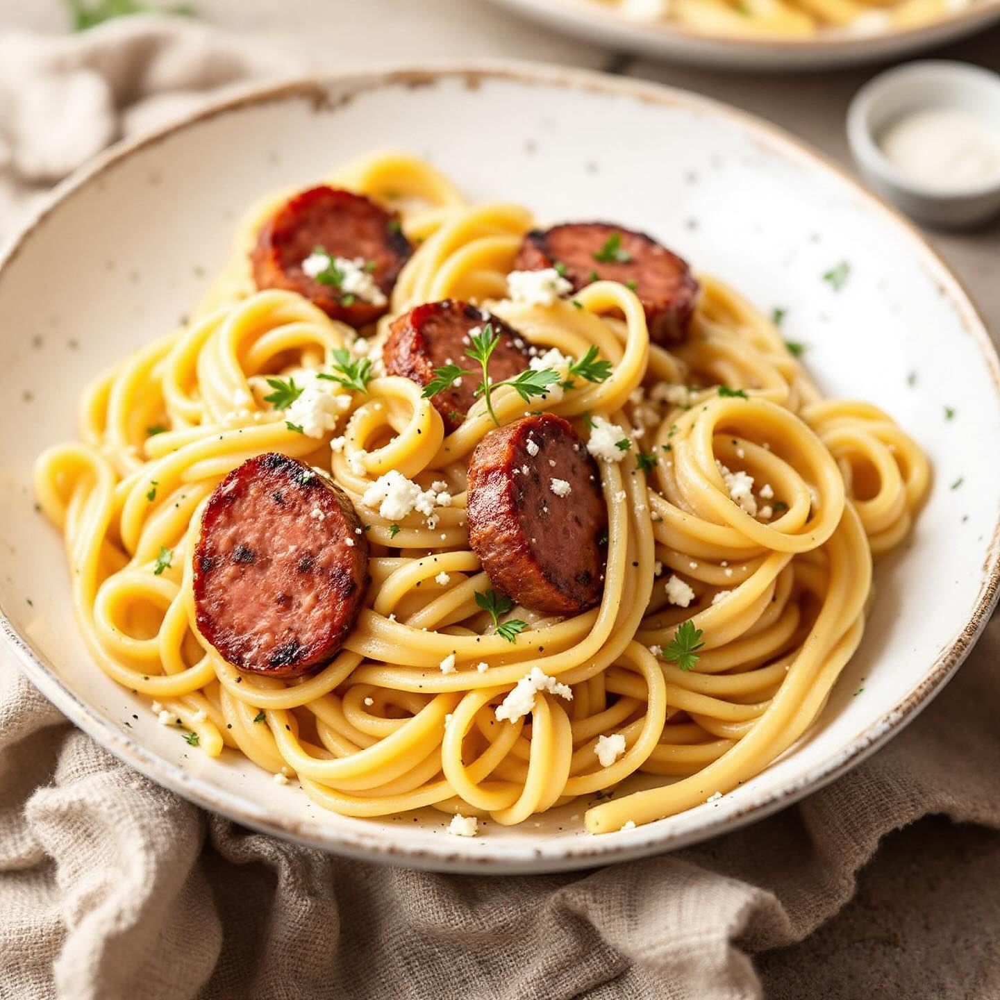

# ### Scampi con Porri, Cicoria e Ceci #### Ingredienti (per 4 persone): - 500 g d

### Scampi con Porri, Cicoria e Ceci #### Ingredienti (per 4 persone): - 500 g di scampi - 2 porri (parte bianca) - 300 g di cicoria - 200 g di ceci cotti (in scatola o lessati) - 2 spicchi d’aglio - 1 cipolla - Olio extravergine d’oliva q.b. - Sale e pepe q.b. - Succo di limone (facoltativo) - Prezzemolo fresco per guarnire #### Procedimento: 1. **Preparazione degli ingredienti**: - Pulisci gli scampi, rimuovendo il carapace e l’intestino. - Affetta i porri a rondelle sottili e lava la cicoria, tagliandola a pezzi. 2. **Cottura di scampi e porri**: - In una taglia di alluminio, scalda un po’ di olio d’oliva e aggiungi gli spicchi d’aglio schiacciati. - Aggiungi i porri affettati e cuoci a fuoco lento finché si ammorbidiscono (circa 5 minuti). - Unisci gli scampi e cuoci per altri 5-7 minuti, fino a quando diventano rosa e opachi. Aggiusta di sale e pepe. 3. **Cottura della cicoria**: - In una pentola, lessa la cicoria in acqua salata per circa 5-7 minuti. Scolala e mettila da parte. - In una teglia di alluminio, scalda un po’ di olio e aggiungi aglio e cipolla tritati. - Aggiungi la cicoria e cuoci per altri 5 minuti, mescolando bene. 4. **Preparazione dei ceci**: - Se i ceci non sono già cotti, lessali in acqua salata finché diventano teneri. Scolali e mettili da parte. 5. **Assemblaggio del piatto**: - Su un piatto di portata, crea un letto di cicoria. - Forma un anello esterno con i ceci attorno alla cicoria. - Al centro, posiziona il composto di porri e scampi. 6. **Servizio**: - Guarnisci con prezzemolo fresco tritato e, se desideri, aggiungi un filo di succo di limone per un tocco fresco. Servi caldo.

---

*Ricetta da @leguminando*
