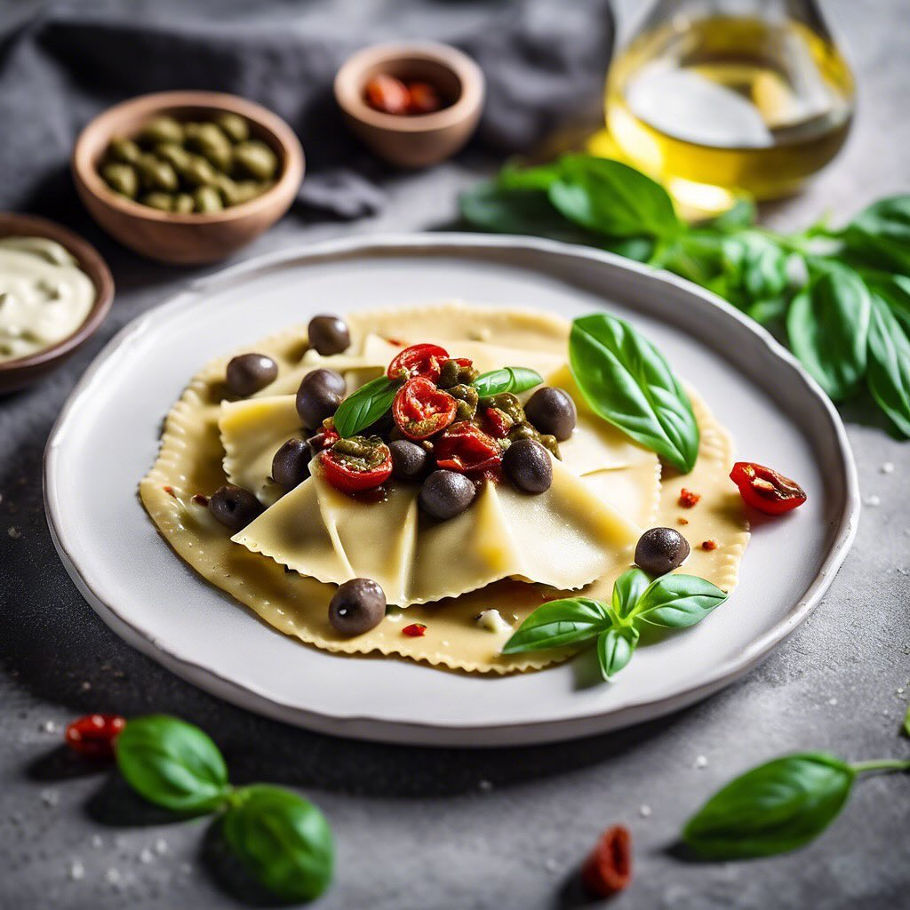

# ### Torta di Carrube e Yogurt Greco #### Ingredienti: - 150 g di farina di carru

### Torta di Carrube e Yogurt Greco #### Ingredienti: - 150 g di farina di carrube - 200 g di yogurt greco - 100 g di miele - 3 uova - 50 g di pinoli - 1 cucchiaino di lievito in polvere - Un pizzico di sale - Zucchero a velo (per decorare, facoltativo) ### Ingredienti e Benefici - **Farina di Carrube**: Questa farina è un ottimo sostituto della farina di grano, ed è naturalmente dolce. È ricca di fibre, antiossidanti e non contiene glutine, rendendola adatta a chi segue diete senza glutine. - **Yogurt Greco**: Aggiunge cremosità e una buona dose di proteine al dolce. Il suo sapore leggermente acido contrasta piacevolmente con la dolcezza del miele. - **Miele**: Oltre ad addolcire, il miele apporta umidità all’impasto e ha proprietà antibatteriche e antinfiammatorie. - **Pinoli**: Questi semi non solo conferiscono una croccantezza piacevole, ma sono anche ricchi di grassi sani e vitamine. ### Varianti della Ricetta - **Aggiunta di Frutta**: Puoi aggiungere pezzi di frutta, come mele o pere a cubetti, per un ulteriore tocco di freschezza. Anche le gocce di cioccolato fondente possono essere un’ottima aggiunta. - **Spezie**: Per un sapore più ricco, puoi aggiungere un pizzico di cannella o vaniglia all’impasto. - **Noci**: Sostituisci i pinoli con noci, nocciole o mandorle tritate per variare la consistenza e il sapore. ### Abbinamenti - **Servire con Frutta Fresca**: Questa torta si abbina benissimo con frutta fresca, come fette di banana o frutti di bosco, che aggiungono freschezza e un contrasto di sapori. - **Yogurt o Gelato**: Una cucchiaiata di yogurt greco o una pallina di gelato alla vaniglia possono rendere il dolce ancora più goloso. - **Salsa al Caramello**: Un filo di salsa al caramello sopra la torta può creare un dessert decadente. ### Conservazione La torta di carrube si conserva bene a temperatura ambiente per 2-3 giorni, oppure in frigorifero per una settimana. Puoi anche congelarla, avvolgendola bene in pellicola trasparente e alluminio, per mantenerne la freschezza.

---

*Ricetta da @leguminando*
