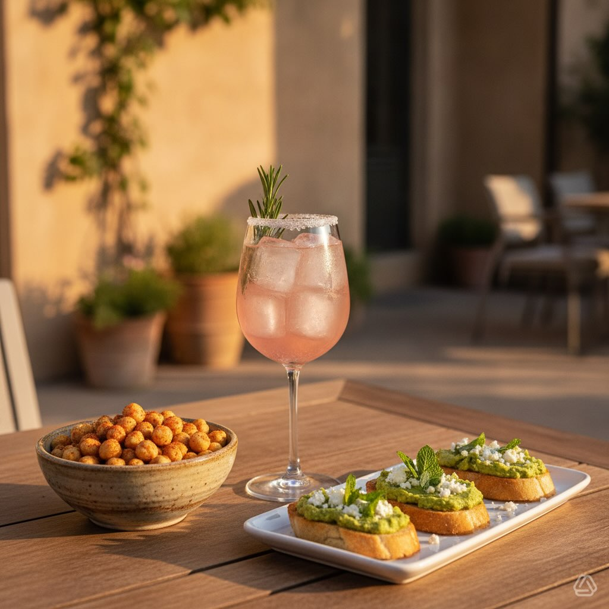

# #leguminando 1️⃣ Il Drink: Ruby Rose Fizz 🍊 Un mocktail fresco, amarognolo e pro

#leguminando 1️⃣ Il Drink: Ruby Rose Fizz 🍊 Un mocktail fresco, amarognolo e profumatissimo. • Ingredienti: 90ml succo di pompelmo rosa, 60ml acqua tonica, 15ml sciroppo al rosmarino, ghiaccio. • How-to: Riempi il bicchiere di ghiaccio, versa il succo di pompelmo e lo sciroppo. Colma con la tonica e guarnisci con un rametto di rosmarino e una fetta di pompelmo. 2️⃣ Lo Sfizio Croccante: Ceci alla Paprika &amp; Lime 🌶️ Addio patatine, benvenuti ceci croccanti e speziati! • Ingredienti: 240g ceci precotti (asciugati benissimo!), 1 cucchiaio di olio EVO, 1 cucchiaino di paprika affumicata, cumino, sale, pepe e scorza di lime. • How-to: Condisci i ceci con olio e spezie. Inforna a 200°C (ventilato) per 20 minuti finché non sono super croccanti. Completa con la scorza di lime fresca! 3️⃣ Il Crostino: Hummus di Piselli &amp; Feta 🥑 Cremosità primaverile su pane tostato. • Ingredienti: 200g piselli sbollentati, 1 cucchiaio di tahina (o caprino), menta fresca, succo di limone, pane rustico, feta sbriciolata. • How-to: Frulla i piselli con la tahina, la menta, il limone, sale e olio. Spalma sul pane tostato e rifinisci con feta sbriciolata e foglioline di menta.

---

*Ricetta da @leguminando*
